# 🔍 Vantage — Cloud Security & OpenStack API Investigation

## Investigation Summary
| Field | Details |
|---|---|
| **Platform** | Hack The Box |
| **Category** | Cloud Security / Network Forensics |
| **Tools Used** | Wireshark |
| **MITRE ATT&CK** | T1595.001, T1110.001, T1530, T1136.003 |
| **Difficulty** | Very Easy |

---

## Scenario
A web server and OpenStack cloud environment belonging to TechVantage has been
compromised. Network packet captures were provided for analysis. The task is to
trace the attacker's actions from initial reconnaissance all the way to
persistence.

---

## Investigation Walkthrough

### Q1. What tool did the attacker use to fuzz the web server?

We open the web server pcap to get a full view of the packets.

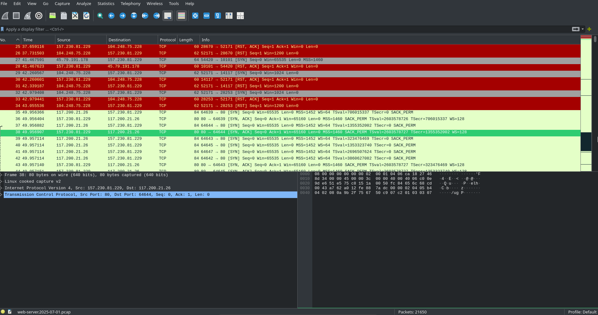

We filter for HTTP protocol which should give us the user agent string.

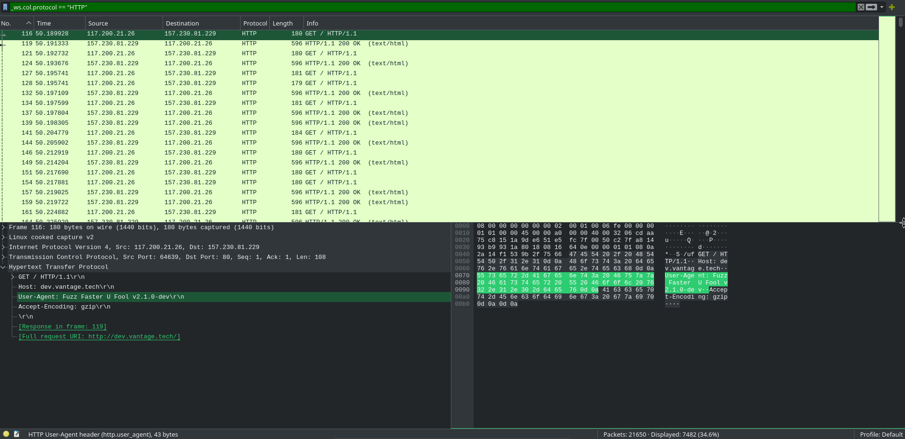

And there we go — **Fuzz Faster U Fool** or **FFUF** in short.

**Answer: Fuzz Faster U Fool v2.1.0**

---

### Q2. Which subdomain did the attacker discover?

Reviewing the logs, the attacker enumerated the active domains of TechVantage.
It would take a long time to look through each log so we sort by response
length instead.

We can observe that from the consistent response of the server, there is
suddenly an influx. We can also see that the attacker has been redirected
from 200 to 302.

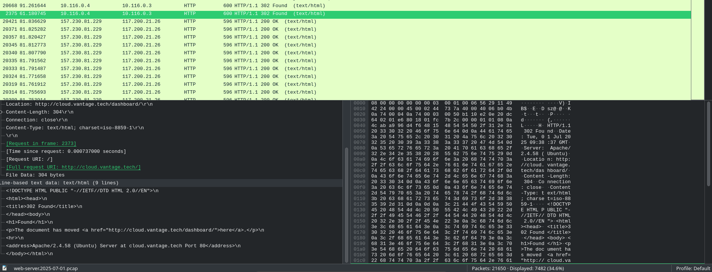

**Answer: cloud**

---

### Q3. How many login attempts did the attacker make before successfully logging in?

Reviewing the logs, we can see that the attacker was redirected to the
dashboard.

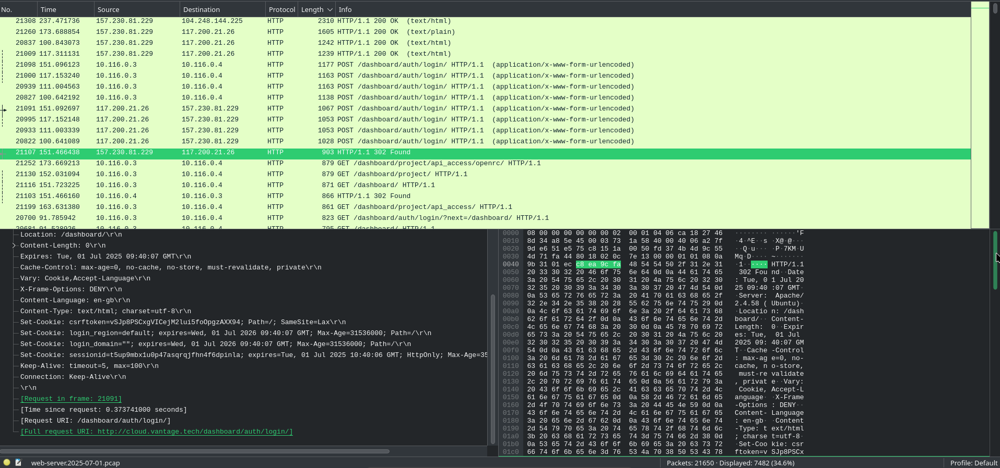

At first glance it looks like 8 attempts but the actual answer is 3. The
attempts are doubled because the machine acts as a reverse proxy. So 3
unsuccessful attempts and 1 successful.

**Answer: 3**

---

### Q4. When did the attacker download the OpenStack API remote access config file? (UTC)

Looking through the logs, we see that the attacker accessed the api_access
folder.

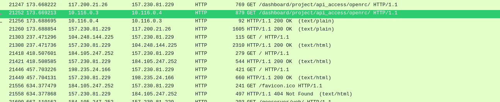

Following the TCP stream confirms what was downloaded.

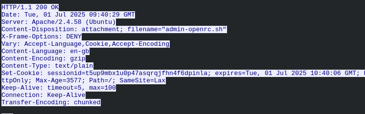

UTC and GMT are almost the same so we can read the timestamp directly.

**Answer: 2025-07-01 09:40:29 UTC**

---

### Q5. When did the attacker first interact with the API on the controller node? (UTC)

To find when the attacker got access to the controller, we filter for the
same source IP 117.200.21.26 and we get this.

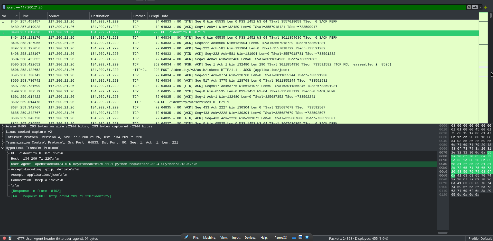

Notice that the user agent has changed — it is now openstacksdk instead of
FFUF.

**Answer: 2025-07-01 09:41:44**

---

### Q6. What is the project ID of the default project accessed by the attacker?

We don't know the project name yet so let's try putting that in the search
filter.

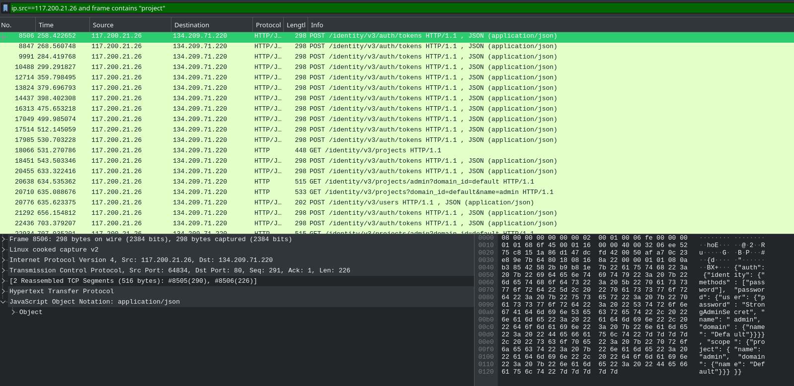

Which gives us this.

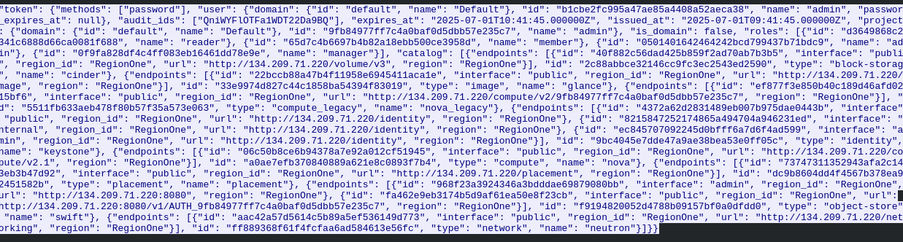

**Answer: 9fb84977ff7c4a0baf0d5dbb57e235c7**

---

### Q7. Which OpenStack service provides authentication and authorization?

Remember when we first saw the attacker interact with the controller? Among
the agents we found keystoneauth. Looking that up confirms it is the
authentication service for OpenStack.

**Answer: keystone**

---

### Q8. What is the endpoint URL of the Swift service?

I tried looking for frames containing swift but hit a dead end.

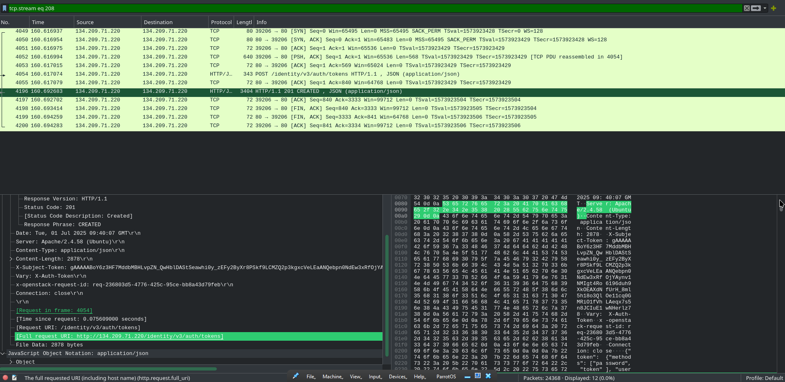

After some research, Swift endpoint URLs follow a pattern like
`https://storage.example.com:8080/v1/AUTH_abc123`. So I looked for a
matching URL in the logs.

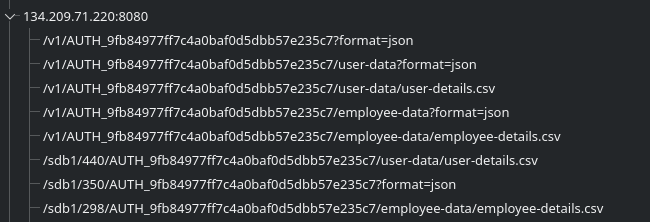

**Answer: hxxp://134.209.71.220:8080/v1/AUTH_9fb84977ff7c4a0baf0d5dbb57e235c7**

---

### Q9. How many containers were discovered by the attacker?

Looking for packets containing the Swift endpoint, we see this.

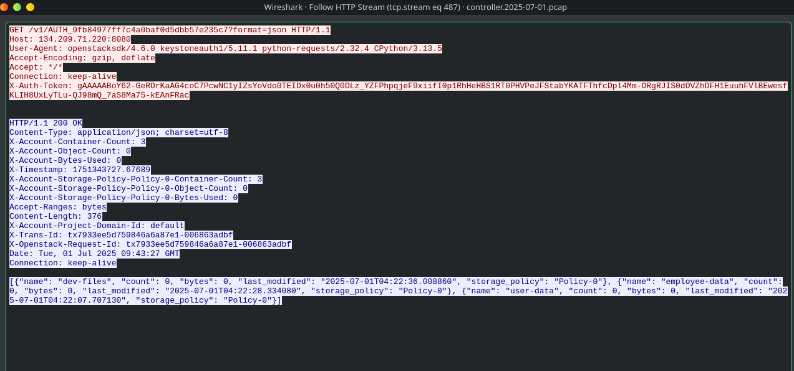

**Answer: 3**

---

### Q10. When did the attacker download the sensitive user data file? (UTC)

Going back to the HTTP requests, we can see a request for user-details.csv.
Applying that to the filter gives us this.

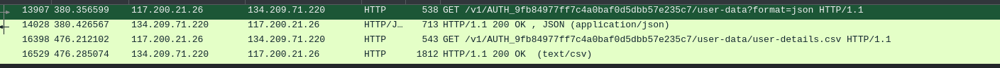

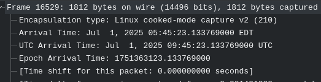

**Answer: 2025-07-01 09:45:23**

---

### Q11. How many user records are in the sensitive user data file?

Following the HTTP stream gives us the full contents of the file.

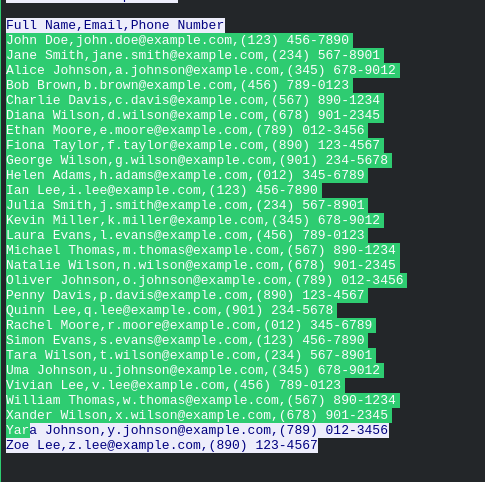

**Answer: 28**

---

### Q12. What is the username of the new user created by the attacker?

Looking at the HTTP requests we see an `/identity/v3/users` directory.
Applying that to the filter gives us this.

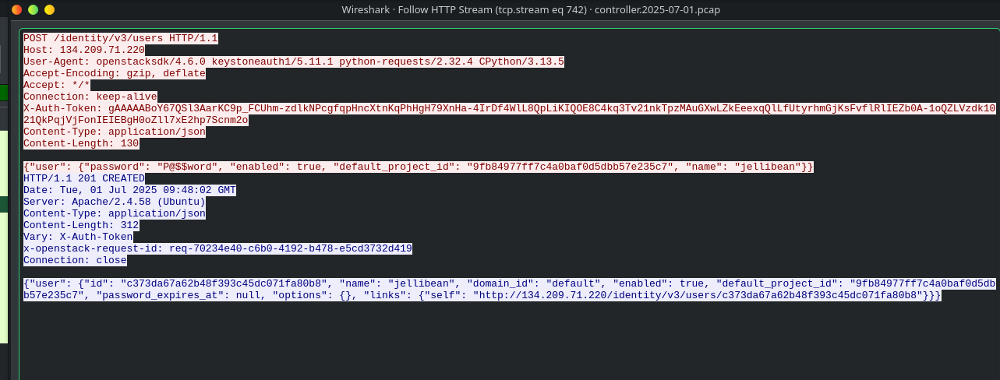

**Answer: jellibean**

---

### Q13. What is the password of the new user?

From the previous screenshot we can also see the password.

**Answer: P@$$word**

---

### Q14. What is the MITRE tactic ID of the technique used in Q12?

We know this is in the cloud and the attacker created an account. Looking
that up in the MITRE ATT&CK framework gives us the cloud-specific technique.

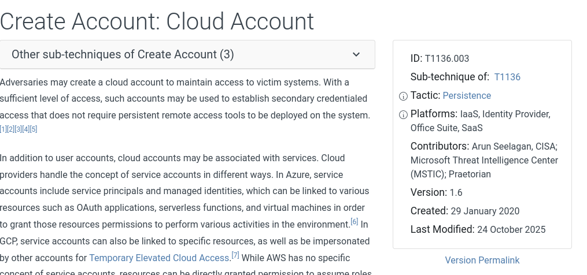

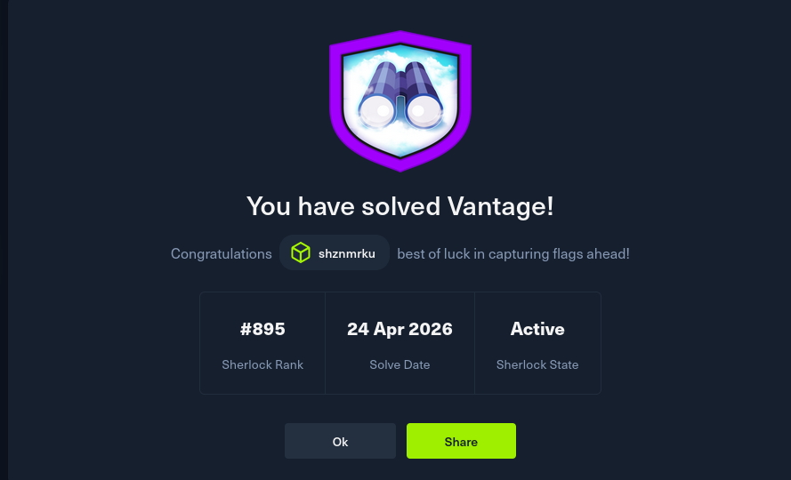

**Answer: T1136.003**

---

## MITRE ATT&CK Mapping

| Technique | ID | Description |
|---|---|---|
| Active Scanning: Fuzzing | T1595.001 | FFUF used to enumerate subdomains and directories |
| Brute Force: Password Guessing | T1110.001 | 3 failed login attempts before successful access |
| Data from Cloud Storage | T1530 | user-details.csv exfiltrated from Swift object storage |
| Create Cloud Account | T1136.003 | New admin user jellibean created for persistence |

---

## IOCs

| Type | Value |
|---|---|
| Attacker IP | `117.200.21.26` |
| Fuzzing Tool | `FFUF v2.1.0` |
| Discovered Subdomain | `cloud.techvantage` |
| OpenStack Controller | `134.209.71.220` |
| Swift Endpoint | `hxxp://134.209.71.220:8080/v1/AUTH_9fb84977ff7c4a0baf0d5dbb57e235c7` |
| Exfiltrated File | `user-details.csv` |
| Persistence Account | `jellibean` |

---

## Key Takeaways

- **Subdomain fuzzing as initial recon** — FFUF is a fast and common tool for
  web enumeration. Sorting Wireshark results by response length is a quick way
  to spot successful hits among hundreds of 404s since successful responses
  tend to have a different size from the noise.

- **Reverse proxy awareness** — The login attempts appeared doubled in the logs
  because the machine acted as a reverse proxy. Understanding the network
  architecture behind what you are analyzing matters a lot for getting accurate
  counts and timelines.

- **OpenStack API abuse** — Once the attacker downloaded the API config file,
  they were able to authenticate directly to the controller using openstacksdk.
  That config file essentially handed them the keys to the cloud environment.

- **Swift object storage as a data store** — The attacker knew exactly what to
  look for once they had API access. Enumerating containers and pulling
  user-details.csv shows that cloud storage is just as much of a target as
  local file systems.

- **Cloud persistence via account creation** — Creating a new admin user is a
  clean persistence mechanism in cloud environments since it does not require
  touching the underlying OS. T1136.003 is worth knowing specifically for cloud
  IR scenarios.

- **Knowing your unknowns** — The Swift endpoint was a blockade for me because
  I was unfamiliar with how OpenStack structures its URLs. Researching the
  expected format first and then matching it against the traffic was the right
  approach. Building familiarity with cloud service API patterns is something
  worth investing time in.

---

## Notes and Thoughts

I was unfamiliar with the Swift endpoint and it became a huge blockade for me.
Additionally I feel like the way I handled the Wireshark filtering was a bit
inefficient. I need to build a more efficient system for filtering instead of
searching broadly and hoping something shows up. Good room overall though,
especially for getting exposure to cloud environments which I had not worked
with much before.