# 🔍 Masquerade — Malware Analysis & C2 Traffic Decryption

## Investigation Summary
| Field | Details |
|---|---|
| **Platform** | TryHackMe |
| **Category** | Malware Analysis / Network Forensics |
| **Tools Used** | Wireshark, Event Viewer, CyberChef, sha256sum |
| **MITRE ATT&CK** | T1566.001, T1059.001, T1071.001, T1573.001, T1036 |
| **Difficulty** | Medium |

---

## Scenario
Jim from the Finance department received an email that appeared to come from
the company's system administrator, asking him to run a script to apply
critical security updates. Trusting the message, Jim executed the script on
his workstation. Shortly after, unusual network traffic and system activity
were observed.

**Note:** These artifacts contain real malware. The challenge can be completed
entirely through static analysis. Analysis was conducted in a controlled
environment.

---

## Investigation Walkthrough

### Getting a Feel for the Scope

Let's get a feel on the scope first.

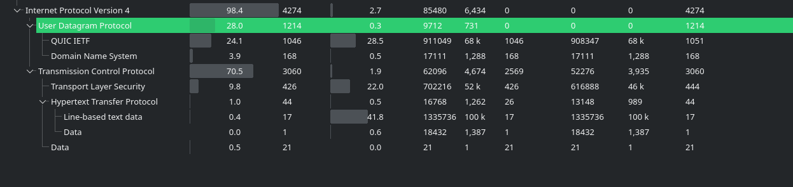

44 packets for HTTP, DNS has 168 packets. Let's check DNS and HTTP protocols
for unusual queries.

There's a recurring msn.com with different subdomains. Let's check the HTTP
statistics to see if this is where the user made requests.

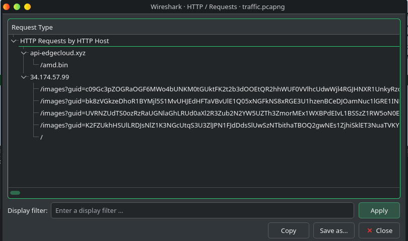

Interesting, there are multiple HTTP requests with different files for
`34.174.57.99` aside from `api.edgecloud.xyz`. Let's cross reference this IP
with the conversation statistics.

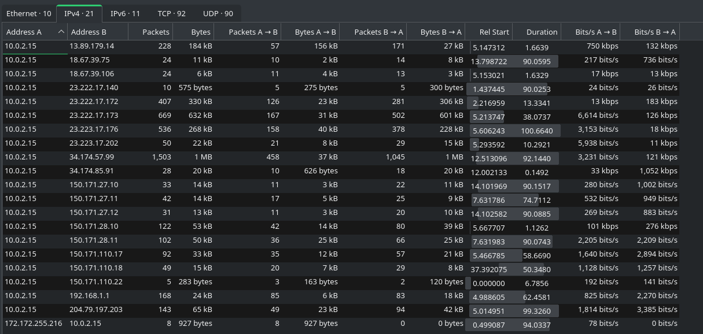

A few notable IPs confirm something. `34.174.57.99` shows up in the HTTP
requests. There is also a one way connection from `172.172.255.216` and some
back and forth from `13.89.179.14`.

Not much that we can find on `172.172.255.216` since every connection was
refused.

Moving on to `34.174.57.99`, this is where we see a lot of juice. The
connection to this also happened after making a request to download `AMD.bin`.

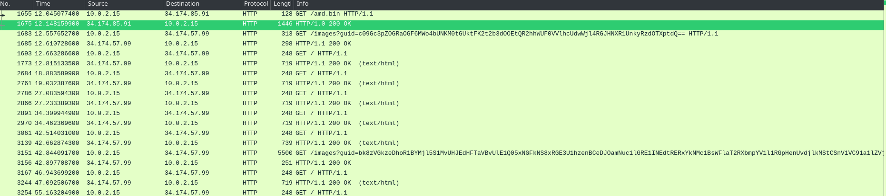

Let's cross check this with the Event Viewer.

---

### Event Viewer Analysis

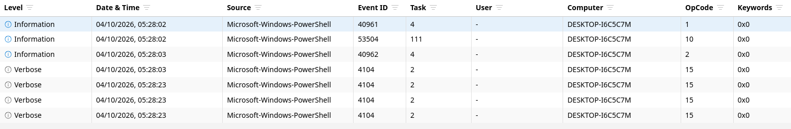

We inspect Event ID 4104 because that's where PowerShell commands were
executed.

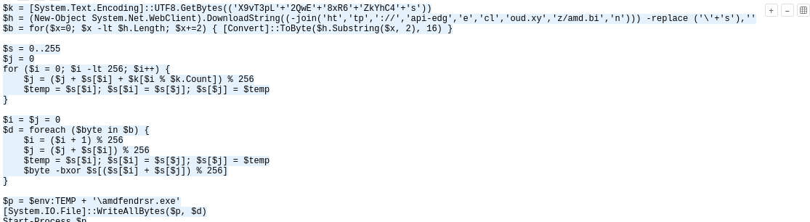

That confirms our packet analysis earlier. There was an HTTP GET request to
download `AMD.bin` and it was saved as `amdfedrsr.exe`.

---

### C2 Traffic Analysis

Going back to Wireshark we see this noise.

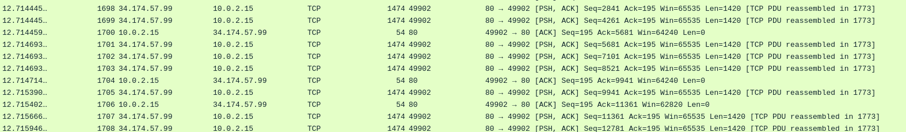

If we actually follow the HTTP stream it's just traffic directed to Google to
generate noise. Remember the HTTP request statistics earlier? Let's add that
to the filter.

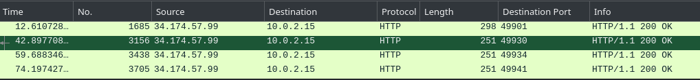

Now we filtered it down to 4 packets. Looking at the GUIDs, they look like
encoded strings rather than gibberish.

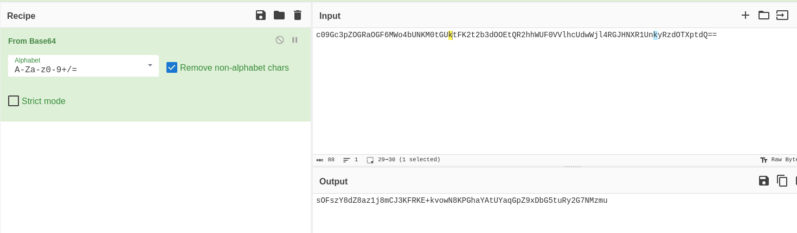

However it still looks gibberish. Let's try deconstructing the exe file that
we get when we decrypt the binary file. We get to see this upon deconstruction.
It's interesting to see how the malware behaves. If you inspect the whole
function, The malware hides commands inside fake HTML comments disguised as CSS references, 
from a C2 that mimics a legitimate Google homepage response, making the traffic
look like normal web browsing to avoid detection.

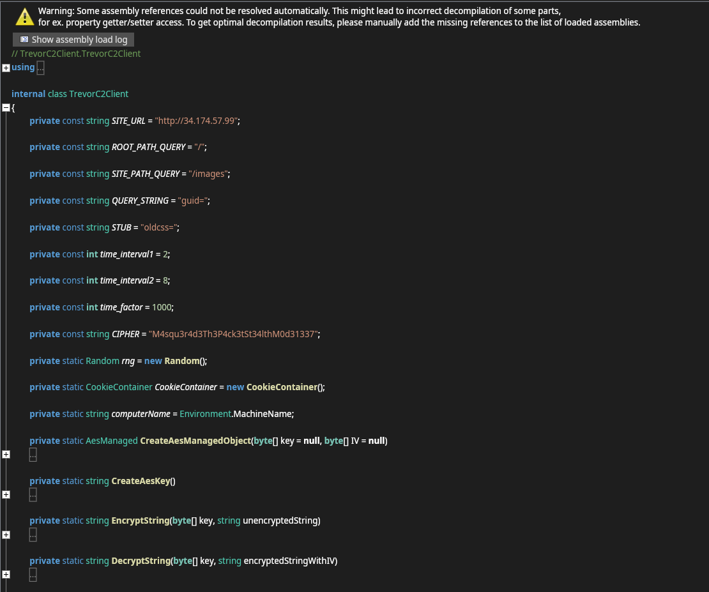

---

### Decrypting the C2 Traffic

So now let's try cracking those GUIDs with this information. We first get the
SHA256 of the cipher.

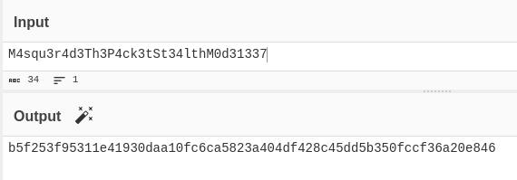

Now we have the key for AES decryption.

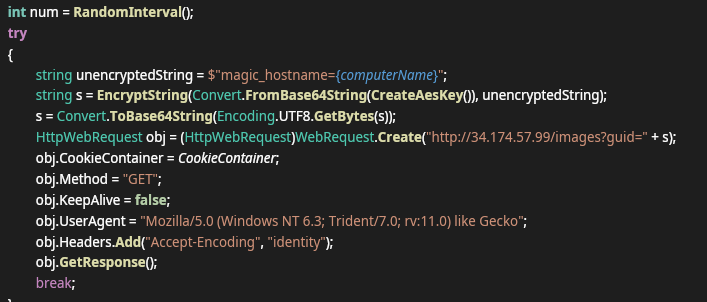

Okay now look at this one. The string S which is the GUID is double encrypted.
If we want to decrypt that, let's reverse it and follow.

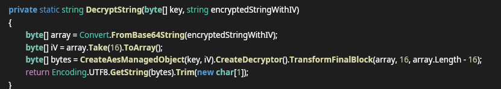

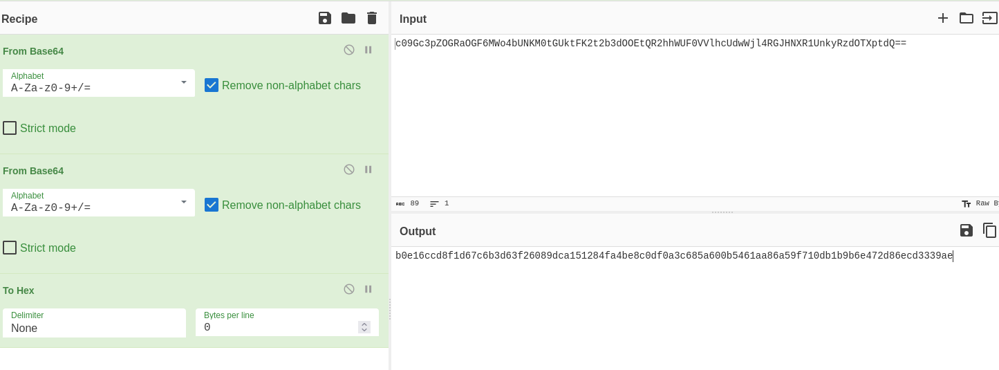

First step is done. Now we take 16 bytes then decode it using the key.

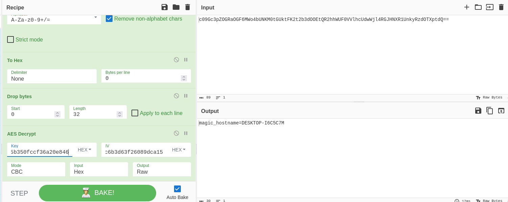

Now we have decrypted it. We can use this to decrypt the other GUIDs too.

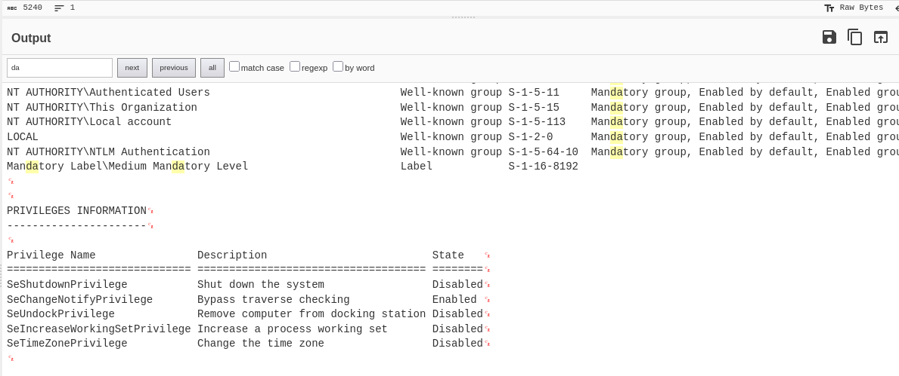

This one is checking for privileges.

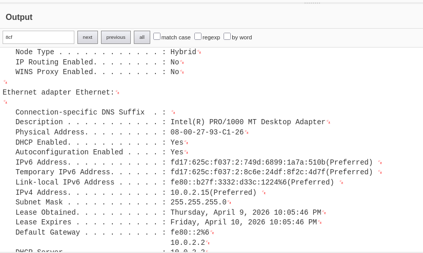

This one is for connections.

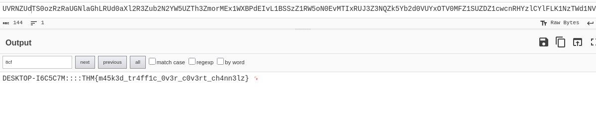

The last GUID contains the flag.

---

### Answering the Questions

**Q1. What external domain was contacted during script execution?**

From the decrypted PowerShell execution we saw in the Event Viewer it was
`api-edgecloud.xyz`.

**Answer: api-edgecloud.xyz**

---

**Q2. What encryption algorithm was used by the script?**

In the PowerShell script, we saw it used RC4 to decode the binary and save
the executable file. I utilized Claude to help me determine what encryption
is used in this scenario.

**Answer: RC4**

---

**Q3. What key was used to decrypt the second-stage payload?**

We can see this in the PowerShell script in the `$k` variable. Combining
those gives us the answer.

**Answer: X9vT3pL2QwE8xR6ZkYhC4s**

---

**Q4. What was the timestamp of the server response containing the payload?**

Following the HTTP stream gives us the timestamp.

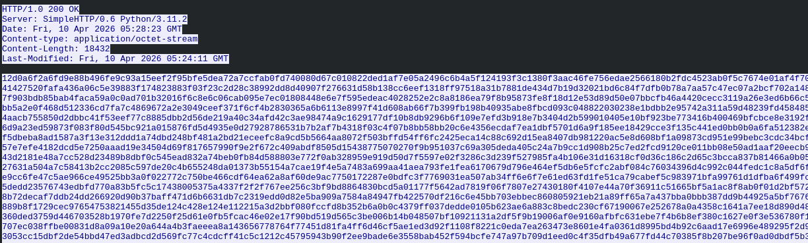

**Answer: Fri, 10 Apr 2026 05:28:23 GMT**

---

**Q5. What is the SHA-256 hash of the extracted and decrypted payload?**

Run sha256sum against the exe file, not the binary. The value will be
consistent no matter what the name is.

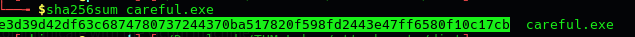

**Answer: e3d39d42df63c6874780737244370ba517820f598fd2443e47ff6580f10c17cb**

---

**Q6. What remote URL did the client use to communicate with the victim machine?**

From the investigation earlier, we know that it was communicating with
`34.174.57.99`.

**Answer: hxxp://34.174.57.99**

---

**Q7. Which encryption key and algorithm does the client use?**

AES to encrypt the traffic with the key found in the malware.

**Answer: M4squ3r4d3Th3P4ck3tSt34lthM0d31337, AES**

---

**Q8. Decrypt the commands and submit the flag.**

From the last GUID, we cracked the code and got the flag.

**Answer: THM{m45k3d_tr4ff1c_0v3r_c0v3rt_ch4nn3lz}**

---

## MITRE ATT&CK Mapping

| Technique | ID | Description |
|---|---|---|
| Phishing: Spearphishing Attachment | T1566.001 | Script delivered via email posing as system admin |
| Command and Scripting: PowerShell | T1059.001 | PowerShell used to download and execute AMD.bin |
| Application Layer Protocol: Web Protocols | T1071.001 | C2 traffic hidden inside HTTP requests to Google |
| Encrypted Channel: Symmetric Cryptography | T1573.001 | AES used to encrypt C2 commands |
| Masquerading | T1036 | Payload saved as amdfedrsr.exe to blend in |

---

## IOCs

| Type | Value |
|---|---|
| C2 IP | `34.174.57.99` |
| C2 Domain | `api-edgecloud.xyz` |
| Initial Payload | `AMD.bin` |
| Dropped Binary | `amdfedrsr.exe` |
| SHA256 | `e3d39d42df63c6874780737244370ba517820f598fd2443e47ff6580f10c17cb` |
| RC4 Key | `X9vT3pL2QwE8xR6ZkYhC4s` |
| AES Key | `M4squ3r4d3Th3P4ck3tSt34lthM0d31337` |

---

## Key Takeaways

- **Traffic masquerading.** The malware routed C2 traffic through Google to
  generate noise and make it look legitimate. The actual commands were hidden
  inside CSS responses. Trusted domains in your traffic are not always clean,
  what's inside the packets matters just as much as where they are going.

- **Multi-layer encryption.** The C2 commands were double encrypted using
  AES. Decrypting them required understanding the encryption flow first,
  getting the key from the binary, then reversing the process step by step.
  Methodology matters a lot here.

- **Static analysis over execution.** The entire investigation was done
  through static analysis without running the malware. Deconstructing the
  exe, reading PowerShell script block logs in Event Viewer, and following
  HTTP streams in Wireshark was enough to fully understand what happened.

- **Event ID 4104 for PowerShell logging.** Script block logging under
  Event ID 4104 was the key to confirming what the malware did on the host.
  This is one of the most valuable Windows event IDs for catching PowerShell
  abuse and worth having enabled in any environment you are monitoring.

- **Masquerading as a detection challenge.** Naming the dropped binary
  `amdfedrsr.exe` is designed to blend in with legitimate AMD driver processes.
  File name alone is not enough to determine if something is malicious, hash
  verification and behavioral analysis are necessary.

---

## Notes and Thoughts

Overall this is a really great room. I enjoyed the whole decryption thing and
the investigation of the malicious file. The most interesting part was figuring
out that the C2 traffic was hiding inside what looked like normal Google
traffic. Good lesson in not trusting familiar domains blindly and always
looking at what is actually inside the packets.
