# SOC Alert Triage Simulation
**Category:** Log Analysis | **Difficulty:** Easy | **Platform:** TryHackMe

---

## Overview

This was a SOC analyst simulation where I worked through a queue of phishing-related alerts, triaging each one, investigating the logs, classifying the incident, and writing a formal case report. The lab covered four alerts total, ranging from a straightforward false positive to an active phishing compromise that required immediate escalation.

Tools used: Splunk, VirusTotal, Cisco Talos

---

## Alert Queue

Starting with the full alert queue. I prioritized the high severity alert first, then worked through the rest.

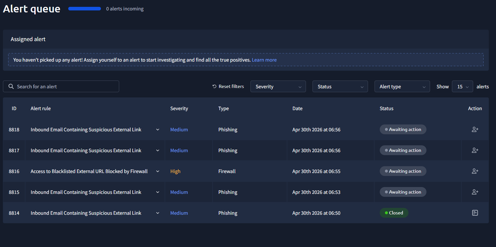

---

## Alert 1: Inbound Email Containing Suspicious External Link (Alert 8814)

**Timestamp:** 04/30/2026 06:48:42.630
**Severity:** Medium
**Source:** Email

### What happened

An alert fired on an inbound email delivered to j.garcia@thetrydaily[.]thm from onboarding@hrconnex.thm. The subject line was "Action Required: Finalize Your Onboarding Profile" and the email contained a link to hxxps://hrconnex[.]thm/onboarding/15400654060/j.garcia. The alert description noted I should check firewall and proxy logs to see if any endpoints attempted to access the URL.

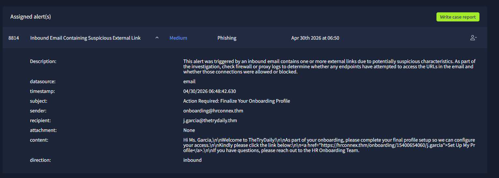

### Investigation

I pulled the raw event in Splunk to confirm the email details and get a full view of the fields.

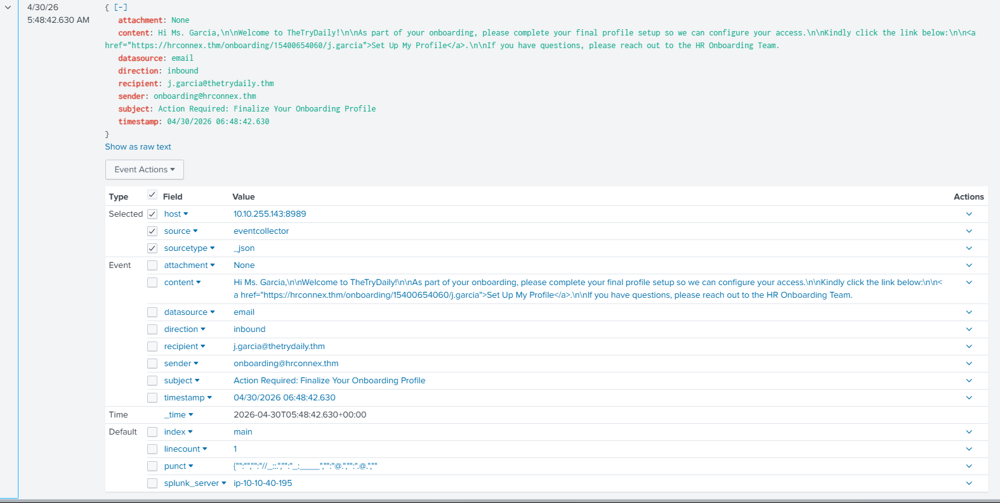

Then I queried for any outbound connections to hrconnex[.]thm from j.garcia's host during the relevant timeframe. Zero results.

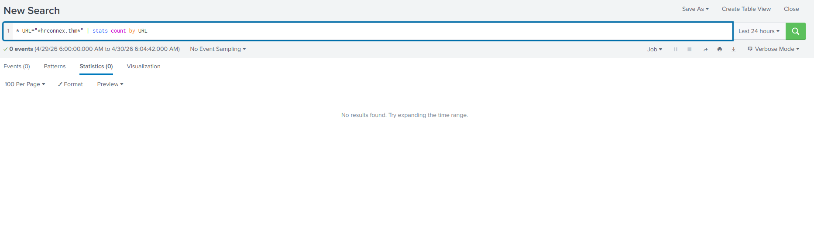

No HTTP requests, no DNS queries, nothing. The email landed in the inbox but the link was never clicked.

### Classification: False Positive

The alert correctly flagged a suspicious email, but no malicious activity occurred. The user never interacted with the link, so there was nothing to contain.

**Incident Report**

| Field | Detail |
|---|---|
| Time of Activity | 04/30/2026 06:48:42.630 |
| Sender | onboarding@hrconnex.thm |
| Receiver | j.garcia@thetrydaily.thm |
| URL | hxxps://hrconnex[.]thm/onboarding/15400654060/j.garcia |

**Reason for False Positive Classification:**
The alert triggered on an email from onboarding@hrconnex.thm to j.garcia@thetrydaily[.]thm containing a suspicious URL. Upon investigation, no outbound HTTP requests to hrconnex.thm were observed from j.garcia's host during the timeframe of the activity. The email was received but the link was not clicked, confirming no user interaction with the URL occurred.

---

## Alert 2: Access to Blacklisted External URL Blocked by Firewall (Alert 8816)

**Timestamp:** 04/30/2026 06:53:09.630
**Severity:** High
**Source:** Firewall

### What happened

A high severity alert fired when a user on 10[.]20[.]2[.]17 attempted to access a URL on the organization's threat intelligence blacklist. The firewall blocked the connection before it completed. The URL was a bit.ly shortlink: hxxp://bit[.]ly/3sHkX3da12340.

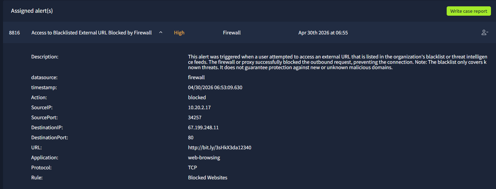

### Investigation

I pulled the raw firewall event in Splunk to confirm the block and note the destination IP.

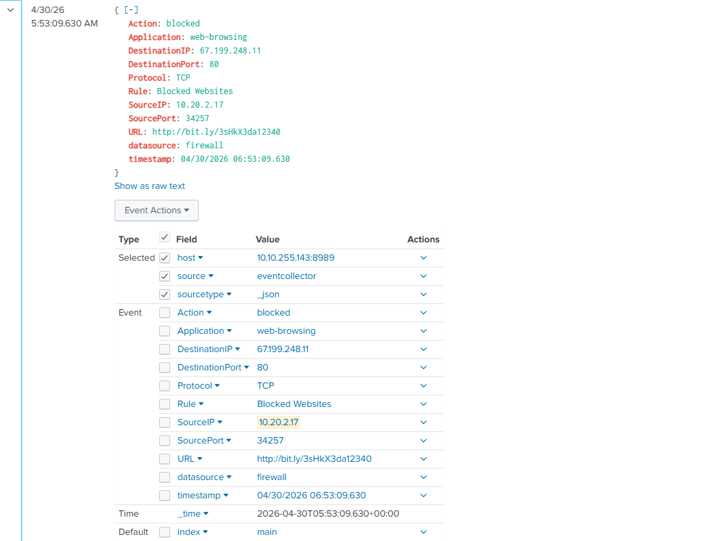

I then queried all URLs accessed by 10[.]20[.]2[.]17 to get broader context on the host's activity. Two URLs came back: the bit.ly link and a Google search for payroll software, which looked like normal user behavior.

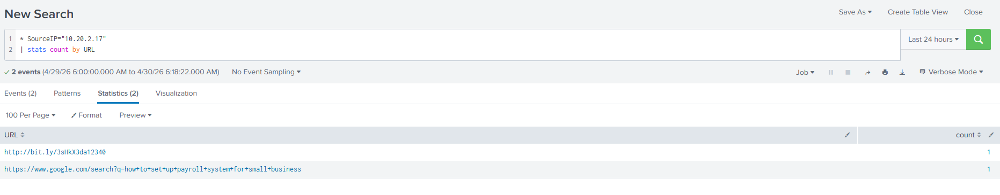

The bit.ly link resolves to hxxps://plixaroo[.]info/ (67.199.248.11). I ran it through VirusTotal.

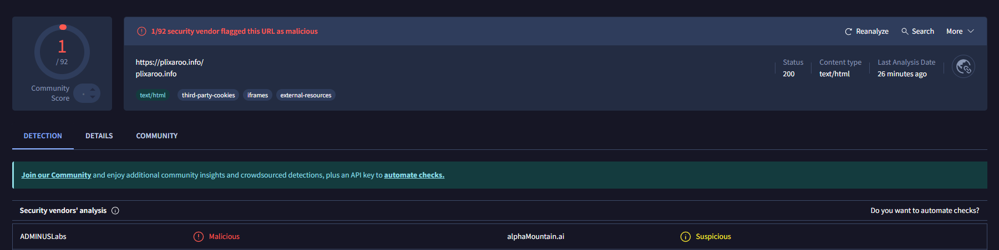

ADMINUSLabs flagged it as malicious, alphamountain.ai flagged it as suspicious. The domain uses third-party cookies, iframes, and external resources, and had no established content category. I also checked Cisco Talos.

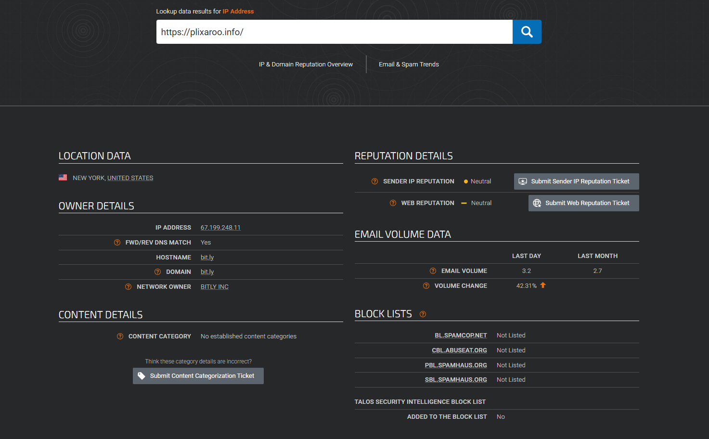

Talos showed a neutral reputation and the IP was not on major blocklists. That said, a low VT detection ratio does not clear a domain. Newly registered or low-traffic phishing infrastructure often has minimal detections early. The combination of a URL shortener pointing to an uncategorized domain with existing malicious flags, over plain HTTP on port 80, was enough to call this.

### Classification: True Positive

The alert correctly identified a real threat. The user attempted to reach a blacklisted, suspicious URL. The firewall blocked the attempt so no connection was completed and no data was exchanged, but the attempt itself was real.

**Incident Report**

| Field | Detail |
|---|---|
| Time of Activity | 04/30/2026 06:53:09.630 |
| Affected User | Hannah Harris, HR |
| Source IP | 10[.]20[.]2[.]17 |
| Destination IP | 67[.]199[.]248[.]11 |
| Phishing Link | hxxp://bit[.]ly/3sHkX3da12340 |
| Redirect Destination | hxxps://plixaroo[.]info/ |

**Reason for True Positive Classification:**
Hannah Harris attempted to access a shortened URL hxxp://bit[.]ly/3sHkX3da12340 that redirected to hxxps://plixaroo[.]info/. VirusTotal flagged plixaroo.info as malicious (ADMINUSLabs) and suspicious (alphamountain.ai). The domain had no established content category and used iframes and third-party cookies consistent with phishing infrastructure. The connection was blocked by the firewall before any data exchange occurred.

**Escalation:** Not required. The connection was blocked at the perimeter. No data was exchanged and no follow-on activity was observed from the host.

**Recommended Remediation:**
- Block outbound connections to 67.199.248.11 and plixaroo.info at the firewall
- Blacklist hxxp://bit[.]ly/3sHkX3da12340 at the proxy level
- Monitor 10.20.2.17 for repeated access attempts

**Attack Indicators:**

| Indicator | Value |
|---|---|
| Phishing email | urgents@amazon[.]biz |
| Phishing link | hxxp://bit[.]ly/3sHkX3da12340 |
| Redirect | hxxps://plixaroo[.]info/ |
| Destination IP | 67[.]199[.]248[.]11 |

---

## Alert 3: Inbound Email Containing Suspicious External Link (Alert 8815)

**Timestamp:** 04/30/2026 06:51:55.630
**Severity:** Medium
**Source:** Email

### What happened

Another email alert, this time for h.harris@thetrydaily[.]thm. The email came from urgents@amazon.biz with the subject "Your Amazon Package Couldn't Be Delivered - Action Required." This is the source event that connected to Alert 8816.

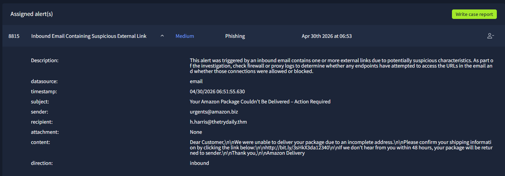

### Investigation

I searched Splunk for activity tied to h.harris and found both events together: the phishing email arriving at 06:51:55 and the firewall block at 06:53:09. This gave me the full picture of the attack chain. Harris received the email and clicked the link, which then got blocked by the firewall.

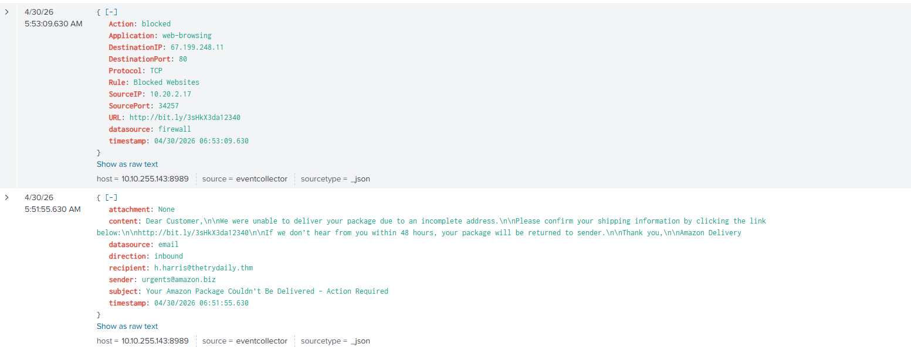

The sender domain, amazon.biz, is not affiliated with Amazon. This is a domain impersonation attempt designed to look like a legitimate delivery notification.

### Classification: True Positive

**Incident Report**

| Field | Detail |
|---|---|
| Time of Activity | 04/30/2026 06:51:55.630 |
| Affected User | Hannah Harris, HR |
| Email | h.harris@thetrydaily[.]thm |
| Source IP | 10[.]20[.]2[.]17 |

**Reason for True Positive Classification:**
Hannah Harris received a phishing email from urgents@amazon.biz at 06:51:55. The sender domain amazon.biz is not affiliated with Amazon and is consistent with a domain impersonation attempt. The email contained a link hxxp://bit[.]ly/3sHkX3da12340 that redirected to hxxps://plixaroo[.]info/, a domain flagged as malicious on VirusTotal. Harris clicked the link, but the connection was blocked by the firewall before any data exchange occurred.

**Escalation:** Not required. Connection was blocked at the perimeter.

**Recommended Remediation:**
- Block emails from urgents@amazon.biz at the email gateway
- Block outbound connections to plixaroo.info and 67.199.248.11
- Notify Hannah Harris about the phishing attempt and advise caution with similar emails

**Attack Indicators:**

| Indicator | Value |
|---|---|
| Phishing email | urgents@amazon[.]biz |
| Phishing link | hxxp://bit[.]ly/3sHkX3da12340 |
| Redirect | hxxps://plixaroo[.]info/ |
| Destination IP | 67[.]199[.]248[.]11 |

---

## Alert 4: Inbound Email Containing Suspicious External Link (Alert 8817)

**Timestamp:** 04/30/2026 06:54:13.630
**Severity:** Medium
**Source:** Email

### What happened

Another email alert, this time for c.allen@thetrydaily.thm. The email came from no-reply@m1crosoftsupport.co with the subject "Unusual Sign-In Activity on Your Microsoft Account." The sender domain immediately stood out: m1crosoftsupport[.]co uses a "1" instead of an "i" to impersonate Microsoft. Classic typosquatting.

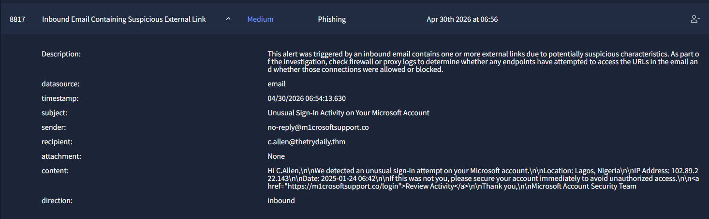

### Investigation

I queried Splunk for any outbound connections from c.allen's host to m1crosoftsupport[.]co/login. One event came back, and it was the worst possible result: Action: allowed.

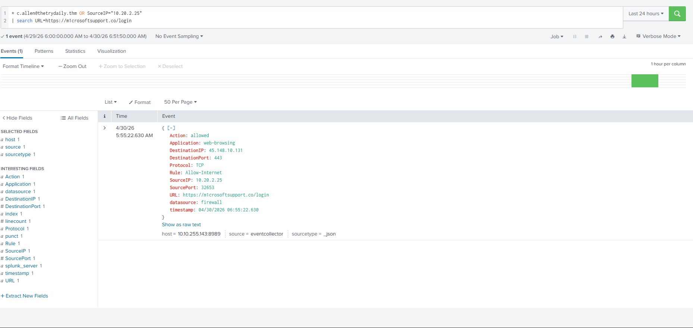

Unlike the previous alerts where the firewall blocked the attempt, this one went through over HTTPS on port 443. c.allen accessed the page at 06:55:22 and likely entered credentials on a fake Microsoft login page. This required immediate escalation.

### Classification: True Positive, Escalated

**Incident Report**

| Field | Detail |
|---|---|
| Time of Activity | 04/30/2026 06:54:13.630 |
| Affected User | c.allen@thetrydaily.thm |
| Source IP | 10[.]20[.]2[.]25 |
| Destination IP | 45[.]148[.]10[.]131 |
| Phishing Link | hxxps://m1crosoftsupport[.]co/login |
| Link Accessed At | 04/30/2026 06:55:22.630 |

**Reason for True Positive Classification:**
c.allen received a phishing email from no-reply@m1crosoftsupport.co. The sender domain uses typosquatting, substituting "1" for "i" to impersonate Microsoft. Unlike previous alerts, the outbound connection to hxxps://m1crosoftsupport[.]co/login was allowed by the firewall over HTTPS on port 443. c.allen accessed the link at 06:55:22, indicating potential credential compromise on a fake Microsoft login page.

**Escalation: YES, Immediate.**
The outbound connection was not blocked. c.allen likely interacted with a credential harvesting page. Immediate host isolation and investigation is required.

**Recommended Remediation:**
- Isolate 10.20.2.25 immediately
- Investigate c.allen's host for credential harvesting, stolen session tokens, or follow-on malware dropped after the connection
- Check browser history, running processes, and active network connections on the host
- Force password reset for c.allen's accounts, especially any Microsoft or M365 credentials
- Block no-reply@m1crosoftsupport.co at the email gateway and 45.148.10.131 at the firewall

**Attack Indicators:**

| Indicator | Value |
|---|---|
| Phishing email | no-reply@m1crosoftsupport[.]co |
| Phishing link | hxxps://m1crosoftsupport[.]co/login |
| Destination IP | 45[.]148[.]10[.]131 |

---

## Full Attack Chain Summary

Two separate phishing campaigns were running simultaneously against thetrydaily.thm:

**Campaign 1: Amazon impersonation**
urgents@amazon[.]biz sent a phishing email to h.harris@thetrydaily[.]thm containing a bit[.]ly shortlink redirecting to plixaroo.info. Harris clicked the link but the firewall blocked the connection. No compromise occurred.

**Campaign 2: Microsoft impersonation**
no-reply@m1crosoftsupport[.]co sent a phishing email to c.allen@thetrydaily[.]thm with a typosquatted Microsoft login page. The firewall did not block the connection. c.allen accessed the page and likely submitted credentials.

---

## Key Takeaways

- **Not all true positives are the same.** Alerts 2, 3, and 4 were all true positives, but only Alert 4 required escalation. The difference was whether the connection was blocked or allowed. A blocked attempt is contained. An allowed connection to a credential harvesting page is an active incident.

- **URL shorteners are a red flag.** bit.ly links in emails hide the real destination. Always resolve them and check the actual domain, not just the shortlink.

- **Low VT detection ratios do not equal clean.** plixaroo[.]info had only 1/92 detections. That is still a flag, especially when the domain is uncategorized and has no legitimate purpose.

- **Typosquatting is everywhere.** m1crosoftsupport[.]co looks close enough to fool a user who is not paying attention. Training users to check sender domains carefully is an important control.

- **Correlated alerts tell a richer story.** Alerts 2 and 3 were connected. Investigating both together revealed the full attack chain, the email source, the user behavior, and the blocked outcome. Triage is not just about closing individual alerts, it is about understanding what is happening across the environment.
