# 🔍 Boogeyman 2 — Memory Forensics Investigation

## Investigation Summary
| Field | Details |
|---|---|
| **Platform** | TryHackMe |
| **Category** | SOC Investigation / Memory Forensics |
| **Tools Used** | Volatility, olevba, md5sum, strings |
| **MITRE ATT&CK** | T1566.001, T1059.005, T1053.005, T1055, T1071.001 |
| **Difficulty** | Medium |

---

## Scenario
Maxine, a Human Resource Specialist working for Quick Logistics LLC, received a
job application with an attached resume. Unbeknownst to her, the attached document
was malicious and compromised her workstation. The security team flagged suspicious
commands executed on her workstation, prompting the investigation.

**Objective:** Analyse and assess the impact of the compromise using email artifacts
and a memory dump.

---

## Investigation Walkthrough

### Q1. What email was used to send the phishing email?

Using the email header screenshot, we can see the sender's email address.

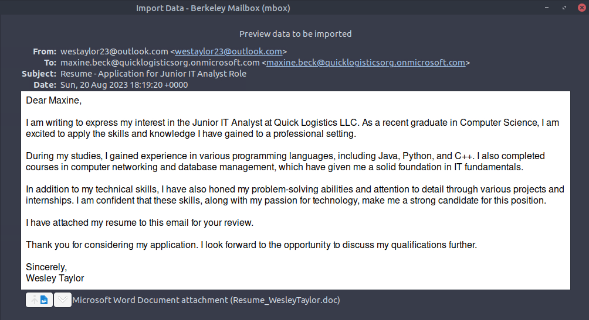

**Answer: westaylor23@outlook.com**

---

### Q2. What is the email of the victim employee?

From the same screenshot, we can identify the recipient.

**Answer: maxine.beck@quicklogisticsorg.onmicrosoft.com**

---

### Q3. What is the name of the attached malicious document?

From the same screenshot, we can see the malicious document name.

**Answer: Resume_WesleyTaylor.doc**

---

### Q4. What is the MD5 hash of the malicious attachment?

Upon extraction of the document, we run md5sum to check for its hash.

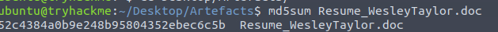

**Answer: 52c4384a0b9e248b95804352ebec6c5b**

---

### Q5. What URL is used to download the stage 2 payload based on the document's macro?

Using olevba, we are able to see the document's macro without opening it.

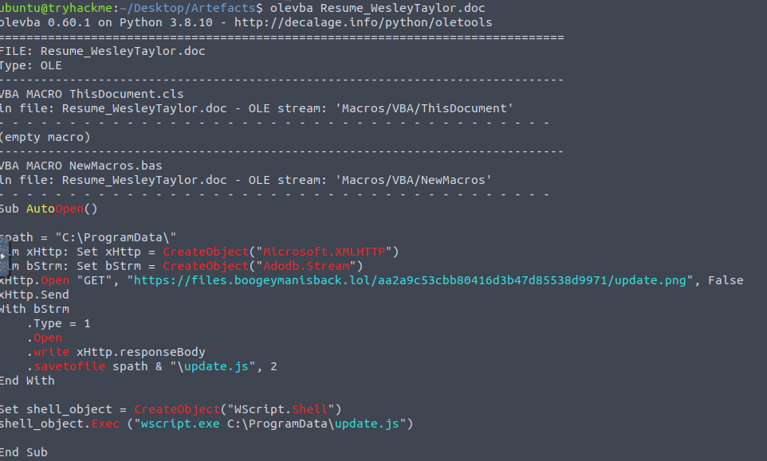

By inspecting the macro, we see it is trying to get something from a remote URL.

**Answer: https://files.boogeymanisback.lol/aa2a9c53cbb80416d3b47d85538d9971/update.png**

---

### Q6. What is the name of the process that executed the newly downloaded stage 2 payload?

Looking at the script, it is going to execute **wscript.exe**.

**Answer: wscript.exe**

---

### Q7. What is the full file path of the malicious stage 2 payload?

The path can be seen from the macro screenshot.

**Answer: C:\ProgramData\update.js**

---

### Q8. What is the PID of the process that executed the stage 2 payload?

We have the memory dump artifact so we can use Volatility. First we identify
the right plugin to use.

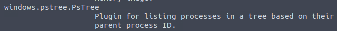

Then we run the plugin while looking for wscript.

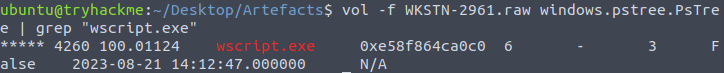

**Answer: 4260**

---

### Q9. What is the parent PID of the process that executed the stage 2 payload?

Without using grep, we are able to see the parent process details directly.

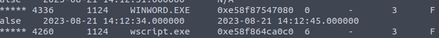

**Answer: 1224**

---

### Q10. What URL is used to download the malicious binary executed by the stage 2 payload?

We already know this from the macro screenshot earlier.

**Answer: https://files.boogeymanisback.lol/aa2a9c53cbb80416d3b47d85538d9971/update.png**

---

### Q11. What is the PID of the malicious process used to establish the C2 connection?

We know the file was named update.js. Looking at the process tree gives us
the answer.

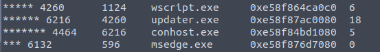

**Answer: 6216**

---

### Q12. What is the full file path of the malicious process used to establish the C2 connection?

Running the cmdline plugin gives us the full path.


**Answer: C:\Windows\Tasks\updater.exe**

---

### Q13. What is the IP address and port of the C2 connection?

We use the netscan plugin to find active network connections.

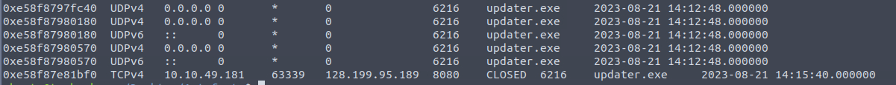

**Answer: 128.199.95.189:8080**

---

### Q14. What is the full file path of the malicious email attachment based on the memory dump?

Running the cmdline plugin reveals the full cached path of the attachment.


**Answer: C:\Users\maxine.beck\AppData\Local\Microsoft\Windows\INetCache\Content.Outlook\WQHGZCFI\Resume_WesleyTaylor (002).doc**

---

### Q15. What is the full command used by the attacker to maintain persistent access?

This was a harder one since the scheduled task does not appear directly in
cmdline. I used memmap to dump schtasks related memory but the output was
incomplete.

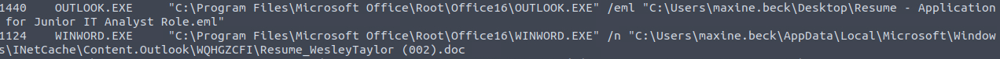

I then tried running strings against the raw file itself and it worked.

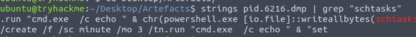

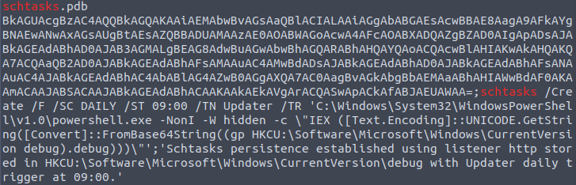

**Answer:**
```
schtasks /Create /F /SC DAILY /ST 09:00 /TN Updater /TR
'C:\Windows\System32\WindowsPowerShell\v1.0\powershell.exe -NonI -W hidden
-c \"IEX ([Text.Encoding]::UNICODE.GetString([Convert]::FromBase64String(
(gp HKCU:\Software\Microsoft\Windows\CurrentVersion debug).debug)))\"'
```

---

## MITRE ATT&CK Mapping

| Technique | ID | Description |
|---|---|---|
| Phishing: Spearphishing Attachment | T1566.001 | Malicious .doc delivered via fake job application email |
| Command and Scripting: Visual Basic | T1059.005 | Macro in .doc executed wscript to run stage 2 payload |
| Scheduled Task | T1053.005 | Daily scheduled task created for persistent PowerShell execution |
| Process Injection | T1055 | updater.exe used to establish C2 from Windows Tasks folder |
| Application Layer Protocol | T1071.001 | C2 communication over HTTP port 8080 |

---

## IOCs

| Type | Value |
|---|---|
| Sender Email | `westaylor23@outlook.com` |
| Malicious Document | `Resume_WesleyTaylor.doc` |
| MD5 Hash | `52c4384a0b9e248b95804352ebec6c5b` |
| Stage 2 URL | `https://files.boogeymanisback.lol/aa2a9c53cbb80416d3b47d85538d9971/update.png` |
| Stage 2 Payload | `C:\ProgramData\update.js` |
| C2 Binary | `C:\Windows\Tasks\updater.exe` |
| C2 Address | `128.199.95.189:8080` |
| Persistence | `Scheduled Task: Updater (daily 09:00)` |

---

## Key Takeaways

- **Malicious macros in Word documents** — The attacker embedded a VBA macro
  that silently downloaded and executed a stage 2 payload using wscript.exe.
  olevba is a quick and effective way to inspect macros without opening the
  document and risking execution.

- **Memory forensics with Volatility** — A lot of the answers in this
  investigation came from the memory dump rather than traditional log analysis.
  Volatility plugins like cmdline, netscan, and memmap each serve a specific
  purpose. Knowing which plugin to reach for is a skill worth building.

- **strings as a fallback** — When the schtasks output from memmap was
  incomplete, running strings directly against the raw dump file was able to
  recover the full command. It is a simple technique but very effective when
  structured plugins fall short.

- **Staging payloads as image files** — The attacker hosted their payload as
  `update.png` to blend in with normal web traffic. The file extension does
  not always match the actual file type, which is worth keeping in mind during
  network forensics.

- **Persistence via registry-backed PowerShell** — The scheduled task used
  a PowerShell one-liner that pulled its payload from the registry
  (`HKCU:\Software\Microsoft\Windows\CurrentVersion debug`). This is a
  fileless persistence technique that is harder to detect since the actual
  payload lives in the registry rather than on disk.

---

## Notes and Thoughts

That was a good lab and I enjoyed that one especially using Volatility. Memory
forensics is a different kind of investigation compared to log analysis and
it was good to get hands on with it. The scheduled task question was the
trickiest part since the standard plugins were not enough and I had to think
outside the box with strings.