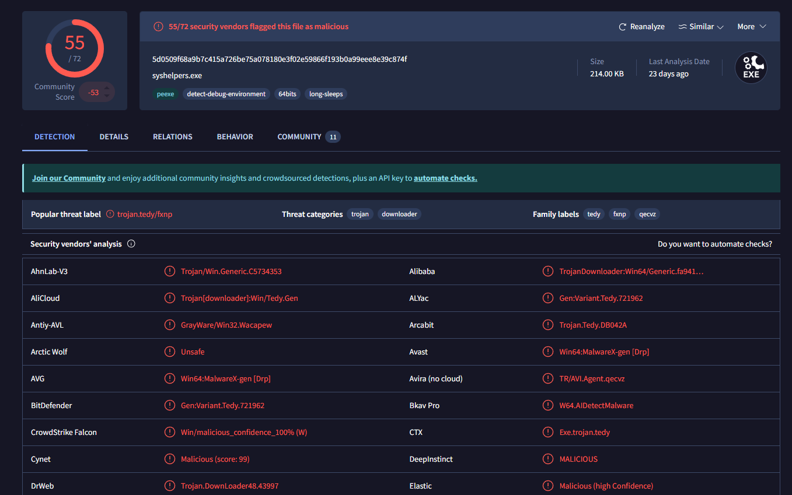
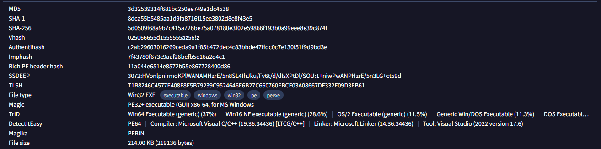
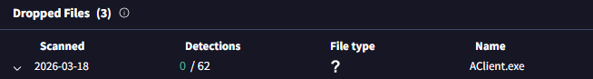
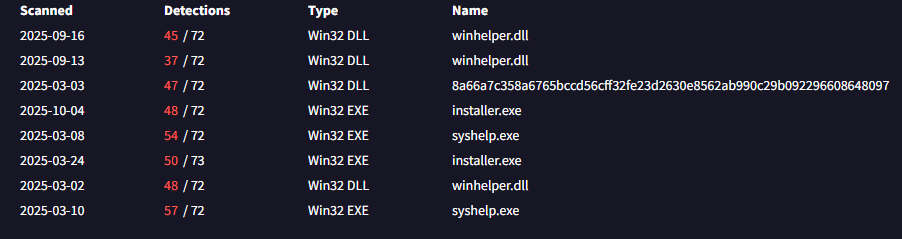
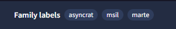
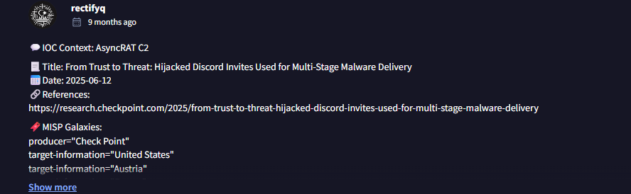
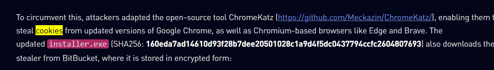
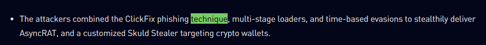
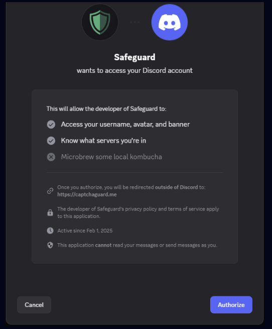
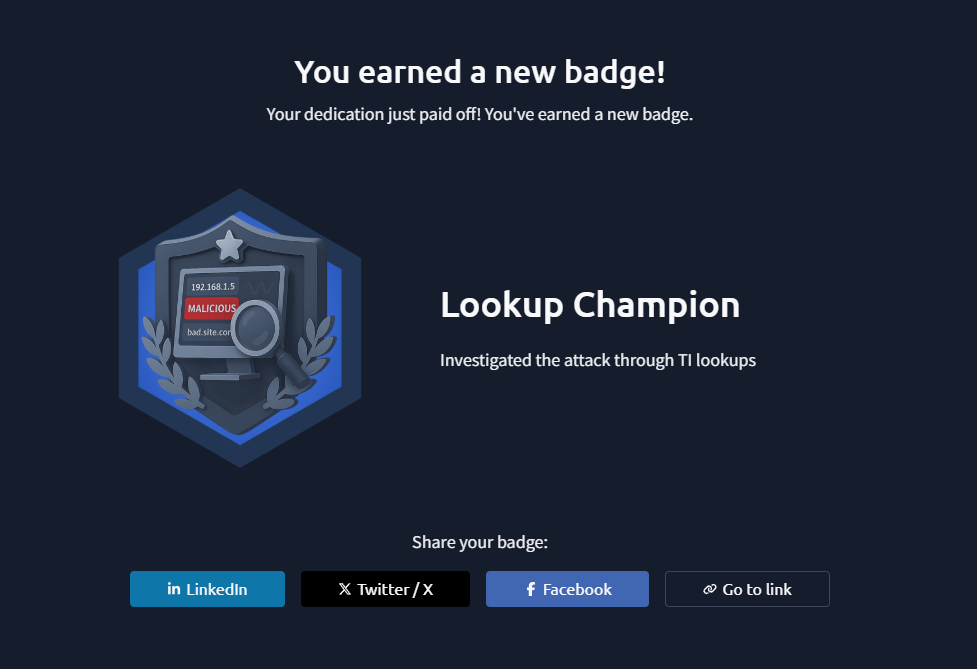

# 🔍 Invite Only — Threat Intelligence Investigation

## Investigation Summary
| Field | Details |
|---|---|
| **Platform** | TryHackMe |
| **Category** | Threat Intelligence / IOC Enrichment |
| **Tools Used** | VirusTotal, Google |
| **MITRE ATT&CK** | T1566 (Phishing), T1204 (User Execution), T1555 (Credentials from Password Stores) |
| **Difficulty** | Easy |

---

## Scenario
You are an SOC analyst on the SOC team at Managed Server Provider TrySecureMe.
You are supporting an L3 analyst in investigating flagged IPs, hashes, URLs, or
domains as part of IR activities. One of the L1 analysts flagged two suspicious
findings early in the morning and escalated them. Your task is to analyse these
findings further and distil the information into usable threat intelligence.

**Flagged IP:** `101[.]99[.]76[.]120`
**Flagged SHA256:** `5d0509f68a9b7c415a726be75a078180e3f02e59866f193b0a99eee8e39c874f`

---

## Investigation Walkthrough

### 1. What is the name of the file identified with the flagged SHA256 hash?

Using VirusTotal, I looked up the flagged SHA256 hash to identify the file
the L1 analyst flagged.

**Answer: syshelpers.exe**

---

### 2. What is the file type associated with the flagged SHA256 hash?

Looking further into the VirusTotal report, we can see the associated file type.

**Answer: Win32 EXE**

---

### 3. What are the execution parents of the flagged hash?

Moving to the **Relations** tab, we can see the execution parents and their
respective hashes. I noted down the hashes for later use.

**Answer: 361GJX7J, installer.exe**

---

### 4. What is the name of the file being dropped?

Still in the Relations tab, we can see the dropped file.

**Answer: Aclient.exe**

---

### 5. Research the second hash and list the four malicious dropped files.

The second hash from question 3 belongs to `installer.exe`:
`fa102d4e3cfbe85f5189da70a52c1d266925f3efd122091cdc8fe0fc39033942`

Searching this hash on VirusTotal reveals the dropped files under the
Relations tab.

**Answer: searchHost.exe, syshelpers.exe, nat1.vbs, runsys.vbs**

---

### 6. What is the malware family that links these files?

We know the flagged IP is `101[.]99[.]76[.]120`. Looking it up on VirusTotal
and checking the Relations tab, one name keeps appearing across the family
labels of the related files.

**Answer: AsyncRAT**

---

### 7. What is the title of the original report where these flagged indicators are mentioned?

Checking the community notes on VirusTotal, we found an article referencing
the AsyncRAT campaign. Used Google to find the full report.

**Answer: Trust to Threat: Hijacked Discord Invites Used for Multi-Stage Malware Delivery**

---

### 8. Which tool did the attackers use to steal cookies from the Google Chrome browser?

Searching for the keyword **"Cookies"** in the report, we found the tool the
attackers used to steal browser cookies.

**Answer: ChromeKatz**

---

### 9. Which phishing technique did the attackers use?

Searching for the keyword **"technique"** in the report, we found the main
phishing technique used by the attackers along with more details about the
overall attack flow.

**Answer: ClickFix**

---

### 10. What is the name of the platform used to redirect users to malicious servers?

According to the report, the attackers leveraged Discord — specifically abusing
their authorization bot **CaptchaGuard** — to redirect victims to malicious
infrastructure.

**Answer: Discord**

---

## MITRE ATT&CK Mapping

| Technique | ID | Description |
|---|---|---|
| Phishing | T1566 | ClickFix phishing via hijacked Discord invites |
| User Execution | T1204 | Victims tricked into executing malicious installer |
| Credentials from Password Stores | T1555 | ChromeKatz used to steal Chrome browser cookies |
| Command and Control | T1571 | AsyncRAT C2 communication over flagged IP |

---

## IOCs

| Type | Value |
|---|---|
| IP Address | `101[.]99[.]76[.]120` |
| SHA256 (syshelpers.exe) | `5d0509f68a9b7c415a726be75a078180e3f02e59866f193b0a99eee8e39c874f` |
| SHA256 (installer.exe) | `fa102d4e3cfbe85f5189da70a52c1d266925f3efd122091cdc8fe0fc39033942` |
| Dropped Files | `searchHost.exe, syshelpers.exe, nat1.vbs, runsys.vbs, Aclient.exe` |
| Malware Family | `AsyncRAT` |
| C2 Platform Abused | `Discord (CaptchaGuard)` |

---

## Key Takeaways
- **IOC pivoting** — Starting from a single hash and IP, we were able to map
  out the full delivery chain by pivoting through VirusTotal's Relations tab.
  This is a core OSINT skill for threat intel work.
- **Trusted platform abuse** — Attackers abused Discord and Pastebin-style
  infrastructure to blend C2 traffic with legitimate services, making detection
  harder at the network level.
- **ClickFix phishing** — A relatively newer social engineering technique where
  victims are tricked into manually executing malicious commands, bypassing
  traditional attachment-based detections.
- **AsyncRAT** — A well-documented open-source RAT frequently used in
  commodity malware campaigns. Recognizing the malware family quickly narrows
  down TTPs and hunting opportunities.