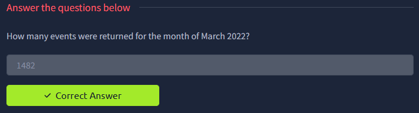
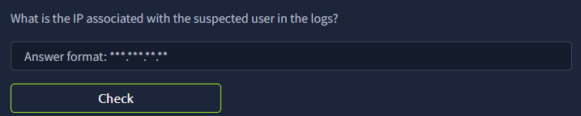
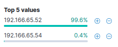
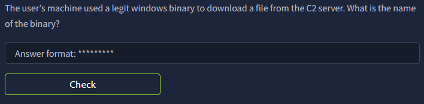
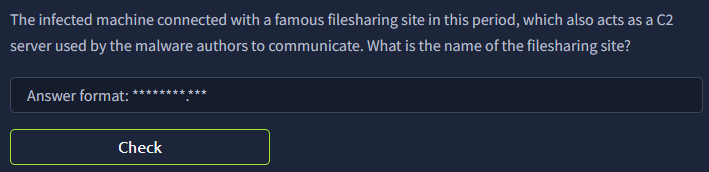
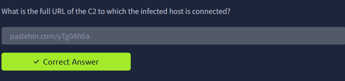
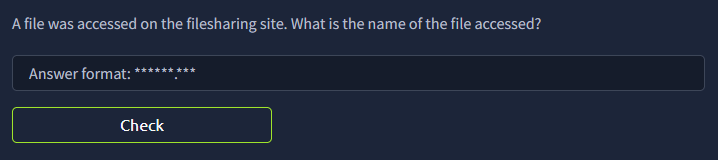
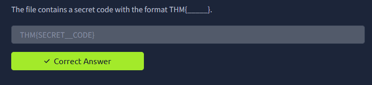
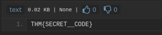

# 🔍 ItsyBitsy — C2 Communication Investigation

## Investigation Summary
| Field | Details |
|---|---|
| **Platform** | TryHackMe |
| **Category** | SOC Investigation / Network Log Analysis |
| **Tools Used** | Elastic SIEM, Kibana |
| **MITRE ATT&CK** | T1197 (BITS Jobs), T1102 (Web Service C2) |
| **Difficulty** | Easy |

---

## Scenario
During normal SOC monitoring, Analyst John observed an alert on an IDS solution
indicating a potential C2 communication from a user **Browne** from the HR department.
A suspicious file was accessed containing a malicious pattern. A week-long HTTP
connection logs have been pulled to investigate. Due to limited resources, only the
connection logs could be pulled out and are ingested into the `connection_logs` index
in Kibana.

**Objective:** Examine the network connection logs of user Browne, find the link and
the content of the file, and answer the questions.

---

## Investigation Walkthrough

### 1. How many events were returned for the month of March 2022?

We got the answer by filtering the date **Absolute** from
`Mar 1, 2022 @ 00:00:00.000` to `Mar 31, 2022 @ 23:59:59.999`

**Answer: 1482**

---

### 2. What is the IP address used by the user Browne?

The user Browne is the one suspected of having a potential C2 communication.
To get his IP address, we just have to add the IP address field.

There are only 2 IPs associated with Browne. The IP address `192.166.65.54`
has only 2 logged entries — upon inspection it's using a different user-agent
called **bitsadmin**. Upon further research, this is a legitimate tool used by
administrators but often abused by attackers.

**Answer: 192.166.65.54**

---

### 3. What is the name of the suspicious user-agent?

We already know this from the previous question since it was using **bitsadmin**.

**Answer: bitsadmin**

---

### 4. What is the domain used by the attacker?

Checking the host field, it connected to **pastebin.com** with a random string
assigned for the URI.

**Answer: pastebin.com**

---

### 5. What is the full URL of the malicious file?

Connecting the random URI string **yTg0Ah6a** to the domain gives us the full URL.

**Answer: pastebin.com/yTg0Ah6a**

---

### 6. What is the name of the file?

Going to the site, there is a text file called **Secret.txt**

**Answer: Secret.txt**

---

### 7. What is the content of the file?

It contains a secret code.

**Answer: THM{...}**

---

## MITRE ATT&CK Mapping

| Technique | ID | Description |
|---|---|---|
| BITS Jobs | T1197 | Attacker abused `bitsadmin` for stealthy file transfer |
| Web Service | T1102 | Pastebin used as C2 dead-drop to host malicious content |

---

## IOCs

| Type | Value |
|---|---|
| IP Address | `192.166.65.54` |
| User-Agent | `bitsadmin` |
| C2 URL | `pastebin.com/yTg0Ah6a` |
| Filename | `Secret.txt` |

---

## Key Takeaways
- **LOLBin abuse** — `bitsadmin` is a trusted Windows binary, making it harder
  to detect via standard AV. The low connection volume (only 2 entries) also
  helps it blend in with normal traffic.
- **Living-off-the-land C2** — Using Pastebin as a staging server avoids custom
  C2 infrastructure that would be easier to block or detect.
- **Detection opportunity** — Filtering for rare user-agents (`bitsadmin` in
  HTTP logs) and outbound connections to paste sites are strong detection signals
  for this TTP.