# 🔍 Boogeyman 3 — Lateral Movement & Domain Compromise

## Investigation Summary
| Field | Details |
|---|---|
| **Platform** | TryHackMe |
| **Category** | Threat Hunting / Lateral Movement Analysis |
| **Tools Used** | Elastic SIEM, Kibana |
| **MITRE ATT&CK** | T1566.001, T1059.001, T1053.005, T1548.002, T1003.001, T1550.002, T1021.002, T1482 |
| **Difficulty** | Medium |

---

## Scenario
Without tripping any security defences of Quick Logistics LLC, the Boogeyman was
able to compromise one of the employees and stayed in the dark, waiting for the
right moment to continue the attack. Using this initial email access, the threat
actors targeted the CEO, Evan Hutchinson, with a phishing email containing a
malicious attachment.

The email appeared questionable but Evan still opened the attachment. After
opening it and seeing nothing happen, he reported it to the security team.

**Incident window: August 29 to August 30, 2023**

---

## Investigation Walkthrough

### Q1. What is the PID of the process that executed the initial stage 1 payload?

We know that the initial payload was an HTML file named
**ProjectFinancialSummary**. Let's query that.

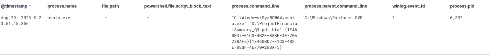

**Answer: 6392**

---

### Q2. What is the full command-line value of the file implant execution?

After the log from Q1, we see that a file was copied to an unusual location.

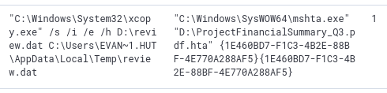

**Answer: "C:\Windows\System32\xcopy.exe" /s /i /e /h D:\review.dat C:\Users\EVAN~1.HUT\AppData\Local\Temp\review.dat**

---

### Q3. What is the full command-line value of the implanted file's execution?

Still following the command log. We see that it was eventually executed.

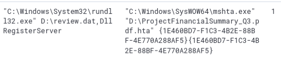

**Answer: "C:\Windows\System32\rundll32.exe" D:\review.dat,DllRegisterServer**

---

### Q4. What is the name of the scheduled task created by the malicious script?

After its execution, a persistence mechanism was established as a scheduled
task. We follow the log where it was first made and we see a PowerShell
execution.

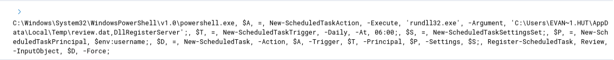

**Answer: Review**

---

### Q5. What is the IP and port used by the C2 connection?

Filtering for rundll32.exe processes since we know that review.dat is being
executed by that process. We can see a sudden burst of processes being made
with the same outbound connection.

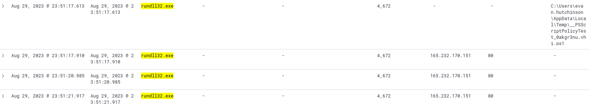

**Answer: 165.232.170.151:80**

---

### Q6. What is the name of the process used by the attacker to execute a UAC bypass?

Upon researching UAC bypass techniques we see this.

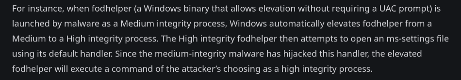

So let's search for any fodhelper processes.

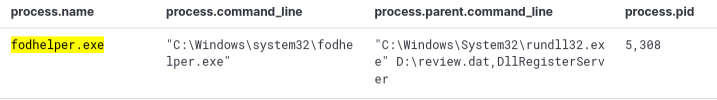

And there we go. We can also see that it's being executed by review.dat.

**Answer: fodhelper.exe**

---

### Q7. What is the GitHub link used by the attacker to download a credential dumping tool?

We look for the logs happening after the UAC bypass. We see a suspicious
encoded command.

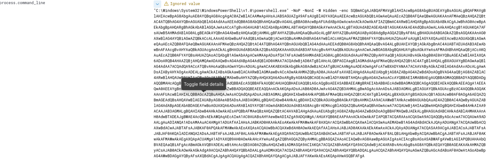

So far this is an encoded command for disabling the defenses of the host and
connecting to the C2 server. Looking further for more logs we see this.

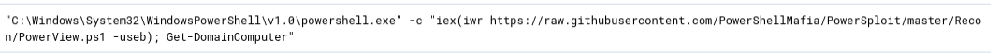

But we are looking for credential harvesting, this is still recon. Then we
also see this.

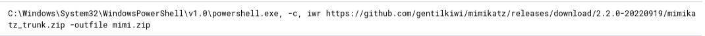

Mimikatz is well known as a credential extraction tool.

**Answer: hxxps://github.com/gentilkiwi/mimikatz/releases/download/2.2.0-20220919/mimikatz_trunk.zip**

---

### Q8. What is the username and hash of the new credential pair?

Since we know it used Mimikatz, let's put that in the filter.

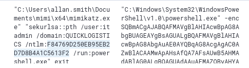

And then we see this. The attacker is no longer on Evan but now is on Allan.

**Answer: itadmin:F84769D250EB95EB2D7D8B4A1C5613F2**

---

### Q9. What is the name of the file accessed by the attacker from a remote share?

We filter for the parent process ID of 6160 and then we see this.

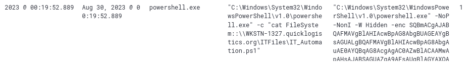

**Answer: IT_Automation.ps1**

---

### Q10. What is the new set of credentials discovered by the attacker?

We already know the new user the attacker moved to is allan.smith. Looking
at the logs we see this.

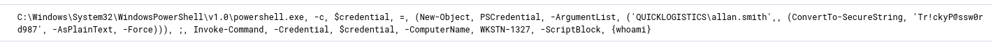

**Answer: QUICKLOGISTICS\allan.smith:Tr!ckyP@ssw0rd987**

---

### Q11. What is the hostname of the attacker's target machine for lateral movement?

We can also see the target host from the same logs.

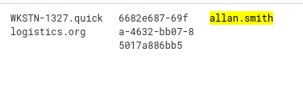

**Answer: WKSTN-1327**

---

### Q12. What is the parent process name of the malicious command executed on the second compromised machine?

Still using the same filter, we know that this is being done remotely.
Looking at the logs we see this.

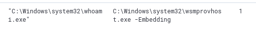

**Answer: WmiPrvSE.exe**

---

### Q13. What is the username and hash of the newly dumped credentials on the second machine?

We know from the logs in Q8 that there were 2 credentials accessed. One was
itadmin and the other was administrator.

**Answer: administrator:00f80f2538dcb54e7adc715c0e7091ec**

---

### Q14. Aside from the administrator account, what account did the attacker dump via DCSync?

Filtering back to processes executed by Mimikatz, we see that besides the
administrator there is also another account.

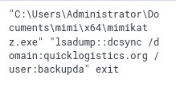

**Answer: (visible in screenshot)**

---

### Q15. What is the link used by the attacker to download the ransomware binary?

Now that we know what host it's using, we add that to the filter and look
for events that use PowerShell. We finally see this.

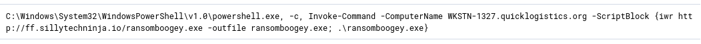

**Answer: hxxp://ff.sillytechninja.io/ransomboogey.exe**

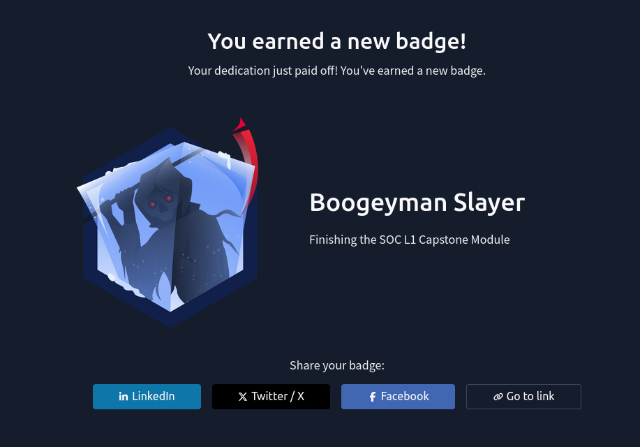

---

## MITRE ATT&CK Mapping

| Technique | ID | Description |
|---|---|---|
| Phishing: Spearphishing Attachment | T1566.001 | Malicious ISO delivered via phishing email to CEO |
| Command and Scripting: PowerShell | T1059.001 | PowerShell used for defense evasion and C2 |
| Scheduled Task | T1053.005 | Persistence via scheduled task named Review |
| UAC Bypass: Fodhelper | T1548.002 | fodhelper.exe used to bypass UAC and elevate privileges |
| OS Credential Dumping: LSASS | T1003.001 | Mimikatz used to dump credentials from LSASS |
| Pass the Hash | T1550.002 | itadmin hash used to move laterally to second machine |
| SMB/Windows Admin Shares | T1021.002 | Remote file share enumeration via new credentials |
| DCSync | T1482 | Domain controller credentials dumped via DCSync attack |

---

## IOCs

| Type | Value |
|---|---|
| Initial Payload | `ProjectFinancialSummary.html` |
| Implanted File | `D:\review.dat` |
| C2 Address | `165.232.170.151:80` |
| Persistence | `Scheduled Task: Review` |
| Credential Tool | `Mimikatz` |
| Compromised Accounts | `evan.hutchinson`, `itadmin`, `allan.smith`, `administrator` |
| Lateral Movement Target | `WKSTN-1327` |
| Ransomware URL | `hxxp://ff.sillytechninja.io/ransomboogey.exe` |

---

## Key Takeaways

- **ISO as a delivery mechanism** — The attacker used an ISO file to bypass
  email attachment scanning. ISO files mount as drives in Windows which means
  the payload runs from a different drive letter entirely, making some detections
  miss it. This is a common modern phishing technique worth knowing.

- **rundll32 for LOLBin execution** — review.dat was executed via rundll32.exe
  using the DllRegisterServer export. This is a classic LOLBin technique that
  abuses a trusted Windows binary to run malicious code without dropping a
  traditional executable.

- **UAC bypass via fodhelper** — fodhelper.exe is a well-documented UAC bypass
  that has been around for years but still works on unpatched systems. Seeing
  it spawn from an unexpected parent process is a strong detection signal.

- **Credential pivoting through the environment** — The attacker went from Evan
  to itadmin to allan.smith to administrator in a chain. Each set of credentials
  opened a new door. This is why credential hygiene and least privilege matter
  so much in an Active Directory environment.

- **DCSync for domain domination** — Once the attacker reached the domain
  controller, they used DCSync to pull hashes without ever touching LSASS
  directly on the DC. This is harder to detect than a direct LSASS dump since
  it looks like legitimate replication traffic.

- **Ransomware as the final stage** — The whole chain from phishing to lateral
  movement to domain compromise was building toward ransomware deployment.
  Catching this earlier in the kill chain, at the UAC bypass or credential
  dumping stage, would have prevented the worst outcome.

---

## Notes and Thoughts

Overall a really good room. I enjoy working on Elastic. I had a bit of trouble
on the credential dumping part since I got confused on the timeline and the
escalation sequence. Manually tracing which user was active at which point
was the key to getting through it. Good reminder that keeping track of the
timeline during an investigation is just as important as knowing the tools.